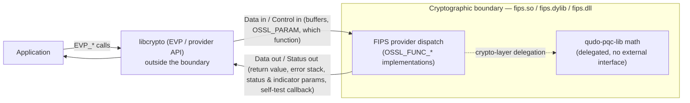
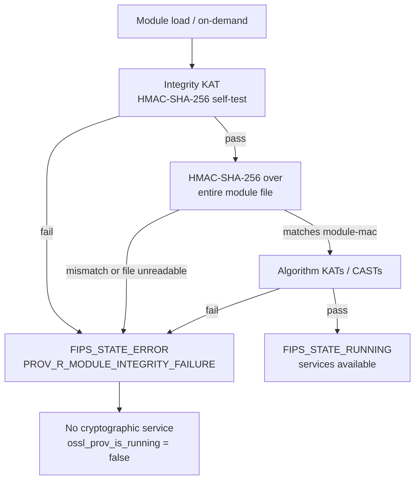
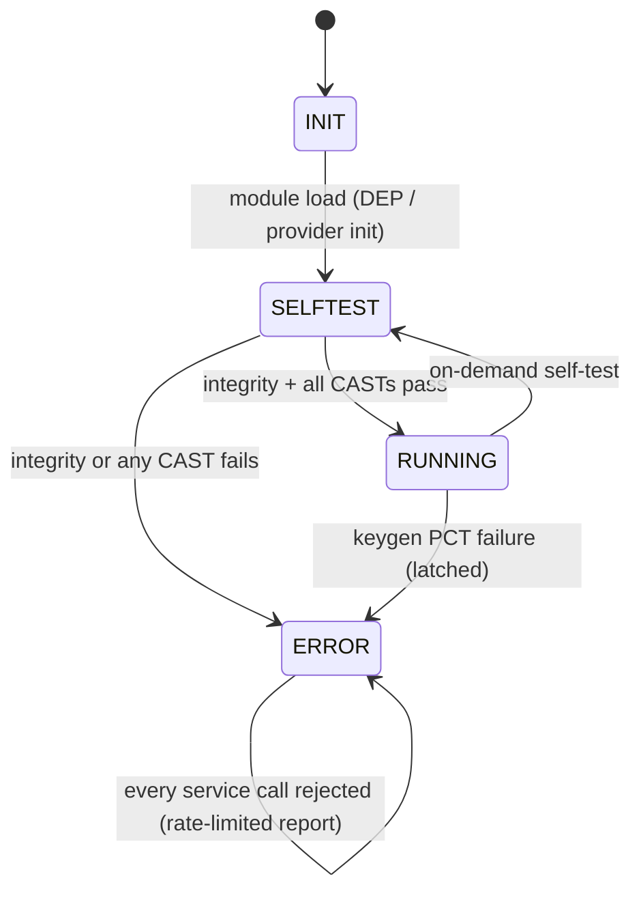

# QudoSSL Cryptographic Module — Non-Proprietary Security Policy

**Document status: DRAFT v0.1 — for internal review (Sprint 4, Story 4.1).**
Not yet internally reviewed or finalised. Administrative facts that cannot be
derived from the source tree are marked **[TO BE CONFIRMED]** and must be
supplied before submission to the CMVP laboratory.

- **Standard:** FIPS 140-3 (ISO/IEC 19790:2012, ISO/IEC 24759:2017)
- **Module:** QudoSSL Cryptographic Module (software), based on the OpenSSL
  3.5.7 FIPS provider (`fips.so` / `fips.dylib` / `fips.dll`)
- **Version / revision / date:** [TO BE CONFIRMED]
- **Classification:** Non-Proprietary

This document follows the CMVP non-proprietary Security Policy structure
(Sections 1–12: General, Specification, Interfaces, Roles/Services,
Software/Firmware Security, Operational Environment, Physical Security,
Non-Invasive Security, SSP Management, Self-Tests, Life-Cycle Assurance,
Mitigation of Other Attacks). The per-area security-level table in §1 maps these
to the ISO/IEC 19790 requirement areas.

> **How this draft was produced.** Sections were drafted from the Sprint 3
> certification-evidence documents (`docs/zeroization-analysis.md`,
> `docs/acvp-status.md`, `docs/side-channel-analysis.md`,
> `docs/boundary-duplicate-hash-disclosure.md`, `docs/interop-report.md`,
> `docs/reproducibility.md`, `docs/subtree-pins.md`) and the ADRs, then checked
> for internal consistency. Every technical claim is grounded in that evidence;
> every unresolved administrative fact is flagged below.

---

## Open items — [TO BE CONFIRMED] register

The following must be resolved during internal review and before submission:

- Module version identifier is [TO BE CONFIRMED] — qudo-pqc-lib has no release tag and is pinned to branch head 73e5499b; a named release must be cut and re-pinned before the cert branch is frozen (docs/subtree-pins.md).
- Exact certificate module name string is [TO BE CONFIRMED] — cert identity moved off the filename to the paperwork (ADR-0006).
- Overall security level assumed Level 1 [TO BE CONFIRMED]; per-area levels stated at Level 1 pending laboratory confirmation.
- Module embodiment classification [TO BE CONFIRMED: multi-chip standalone assumed].
- Exact tested-platform build strings for all four OEs (Linux x86-64, Linux aarch64, macOS arm64, Windows x64) are [TO BE CONFIRMED].
- Vendor name and point of contact are [TO BE CONFIRMED].
- CMVP/CAVP certificate numbers and delivery mechanism are [TO BE CONFIRMED].
- All boundary symbol measurements are from the macOS arm64 artifact only; per-OE symbol inventories (x86-64 uses AVX2 backends, differing symbol names/counts) are not yet produced (boundary-duplicate-hash-disclosure.md §7, open item 1).
- Windows x64 reproducible-build determinism is not verified — a green two-build comparison is a prerequisite before that OE is submitted (docs/reproducibility.md).
- Install-path collision between the module's stock filename fips.so/.dylib/.dll and a host system OpenSSL FIPS provider must be checked at integration (ADR-0006).
- The FIPS module boundary source manifest (providers/fips.module.sources / build.info / fips.checksum) has not been amended to list the delegated qudo math; correcting it will change the module's own boundary definition (boundary-duplicate-hash-disclosure.md §4.2e, open item 3).
- Module version identifier / cryptographic module name string is unset — qudo-pqc-lib is pinned to branch head main @ 73e5499b with no release tag (docs/subtree-pins.md); cut and pin a tag before the cert branch is frozen. [TO BE CONFIRMED]
- All CAVP certificate numbers are [TO BE CONFIRMED]; per D3 no OpenSSL certificate is reused and no validation has completed.
- Overall FIPS 140-3 security level assumed Level 1. [TO BE CONFIRMED: overall level]
- Final approval disposition of SHA-1-in-signature, Triple-DES (encrypt vs legacy-decrypt), and DSA (verify-only) is a CMVP determination and must be confirmed with the laboratory.
- Standalone FIPS approvability of the ML-KEM hybrid combiners (X25519MLKEM768, X448MLKEM1024, SecP256r1MLKEM768, SecP384r1MLKEM1024) is unresolved — NIST/CMVP determination pending. [TO BE CONFIRMED]
- Entropy source: SEED-SRC is in the base provider (outside the module boundary); SP 800-90B entropy-source validation, caveat, and any load bearing on the DRBG security strength are [TO BE CONFIRMED].
- ACVP evidence for ML-KEM/ML-DSA is a single local macOS arm64 run (525 cases, 0 errors); no CI run observed on any OE and no Windows evidence exists (docs/acvp-status.md Open items 2-3, 9). The submission must not claim 'passes in CI on four OEs' until logs exist.
- Per-OE (x86-64 AVX2, aarch64, Windows) symbol inventories for the duplicate-hash disclosure are not yet produced; Class A names/counts differ from the macOS arm64 figures cited (disclosure §7 item 1).
- Class B residue (29 generic SHA-2/SHA-3 symbols) removal is offered but NOT YET DONE and would move the qudo-pqc-lib subtree pin; laboratory preference needed (disclosure §7 item 2).
- boundary source manifest (openssl/providers/fips.module.sources, fips.checksum, build.info) does not list any qudo-pqc source; the module's own boundary enumeration must be corrected before submission (disclosure §4.2e, §7 item 3).
- Final non-approved-but-allowed (Table 3) list and KTS claims are CMVP determinations. [TO BE CONFIRMED]
- A residual duplicate OpenSSL ML-DSA *lattice* implementation (ossl_ml_dsa_matrix_*, poly_ntt, vector_expand_S) remains reachable via key decode paths and needs its own disposition (disclosure §7 item 7).
- Module name string reported via OSSL_PROV_PARAM_NAME (configure-time FIPS_VENDOR) is unresolved in the tree - [TO BE CONFIRMED].
- Module version identifier for the certificate is [TO BE CONFIRMED]: the provider reports OpenSSL 3.5.7, but qudo-pqc-lib is pinned to main @ 73e5499b with no release tag (subtree-pins.md).
- Overall Security Level is assumed Level 1 - [TO BE CONFIRMED: overall level]; confirm before finalising the trusted-channel and port statements.
- Confirm with the laboratory whether a separate ISO 19790 control-output interface enumeration is required, or whether folding it into status/data output is acceptable.
- Exact tested platform build strings for the four OEs (Linux x86-64, Linux aarch64, macOS arm64, Windows x64) are not derived here and are [TO BE CONFIRMED].
- The installed-module path is filename-identical to a stock OpenSSL FIPS provider (fips.so); ADR-0006 flags an install-path collision check that should be reflected if the interfaces/delivery section references installation.
- Module version identifier is [TO BE CONFIRMED] — qudo-pqc-lib is pinned to main @ 73e5499b with no release tag, so the composite module version string cannot be fixed.
- CAVP algorithm certificate numbers, CMVP certificate number, vendor name/contact, tested-platform build strings, and delivery mechanism are all [TO BE CONFIRMED].
- Overall security level assumed 1 [TO BE CONFIRMED: overall level]; if higher, §4.3 must gain an authentication mechanism, strength claim, and authentication SSPs.
- CO/User service partition: at Level 1 the module enforces no role separation; confirm the lab's expected partition of services between the two roles.
- Approval-mode / indicator treatment of hybrid KEMs (X25519MLKEM768, X448MLKEM1024, SecP256r1MLKEM768, SecP384r1MLKEM1024), SHA-1 allowed uses, and Triple-DES status against the current FIPS 140-3 transition schedule are [TO BE CONFIRMED].
- Per-service SSP access for SLH-DSA (services 11-13) rests on OpenSSL-native code that has not yet had a CSP-inventory pass (zeroization-analysis.md Open item 11); reconcile before finalising.
- SSP access columns are derived from a single-OE (macOS arm64) CSP inventory; multi-OE confirmation is outstanding.
- Overall security level is assumed Level 1 — must be confirmed for the record.
- Module version identifier is unresolved: qudo-pqc-lib has no release tag; the pin is a branch head (main @ 73e5499) and must be re-pinned to an immutable tag cut on that commit before the cert branch is frozen.
- Exact tested-platform build strings for all four OEs (OS version/build, kernel, distribution, compiler version) are not captured — CI runner image names are not certification build strings.
- No CI-produced OE run evidence exists (Sprint 4 Story 4.2); the CI workflow triggers only on PRs into main and development merged to dev, so build/test/operational-test results per OE are TO BE CONFIRMED.
- Windows x64 has never been observed to build or to pass nmake test; treat as an unstarted OE, not a completed one.
- The certified FIPS module file itself is not yet inside the reproducible-build comparison (Story 6.1 links the archive in; Story 6.7 owns the full three-artifact cross-OE check); byte-identity of the certified module across two builds is unconfirmed.
- Windows reproducibility (/Brepro) is not verified; a PowerShell equivalent of verify-reproducible.sh and a green two-build comparison are prerequisites.
- Boundary source manifest (providers/fips.module.sources, fips/build.info, fips.checksum) does not list the linked qudo-pqc sources and must be corrected before submission — this changes the module's own boundary definition.
- Whether processor algorithm accelerators (AES-NI/AVX2, ARMv8 SHA/NEON) are claimed as tested PAA/PAI, and the per-OE symbol inventories, are undecided.
- Confirm the installed fips.so path cannot collide with a system OpenSSL FIPS provider on a host that also has one installed (ADR-0006).
- Overall validation Security Level is assumed Level 1 — confirm the level for the certificate; §7 and §8 dispositions depend on the software embodiment at that level.
- Module version identifier is unresolved: qudo-pqc-lib has no release tag (pinned to branch head 73e5499b) and its 1.0.0 version string is not uniquely traceable. Cut a named release and re-pin to a tag, then fix the QudoSSL module version that binds to both subtree SHAs, before the cert branch is frozen.
- Delivery mechanism and vendor name/contact are undetermined (§11.2).
- Exact tested-platform build strings / toolchain versions per OE (Linux x86-64, Linux aarch64, macOS arm64, Windows x64) are not recorded (§11.4).
- Windows x64 reproducible build is not yet verified; /Brepro alone is insufficient (MSVC ignores SOURCE_DATE_EPOCH; PDB paths, debug directory, lib.exe member ordering/timestamps outstanding). A PowerShell verify-reproducible equivalent and a green two-build comparison are prerequisites before Windows submission.
- The FIPS module fips.so has not yet joined the byte-for-byte reproducibility comparison (Story 6.7); only libqudo-pqc.a, libcrypto and libssl were demonstrated in Sprint 1.
- QudoSSL Crypto Officer Guide is a required Area 11 deliverable but does not yet exist; its story/deliverable reference must be re-confirmed (design-errata records Stories 4.2–4.4 as removed under delegation). The vendor's qudo-pqc-lib CRYPTO_OFFICER_GUIDANCE.md predates delegation and does not govern this module.
- End-of-life / SSP sanitization procedures are not documented (§11.6).
- No measured constant-time evidence exists for delegated ML-KEM or ML-DSA on any OE; §12.2 is source review only and must be presented as a design review under IG D.E, not as measurement.
- Deferred CT-poisoning prerequisite (UD-4): OpenSSL ml_kem.c:2518 poisoning under-covers ML-KEM-768/1024 and never reaches the rejection secret z. It affects no shipped binary (OPENSSL_CONSTANT_TIME_VALIDATION undefined) but must be widened to the rank-aware expression before any ML-KEM-768/1024 constant-time validation run.
- macOS arm64 will have no direct constant-time measurement (valgrind lacks Apple Silicon support); if it is a claimed OE, the lab must be told its CT argument rests on source review + inherited HOL-Light + by-proxy Linux/aarch64 measurement.
- A written ML-DSA rejection-sampling side-channel position is required before lab engagement (§12.5); it is an argument, not a measurement.
- Inherited CBMC/HOL-Light constant-time proofs for mlkem-native/mldsa-native must be formally accepted as inherited upstream evidence and recorded as such; QudoSSL has not run them or obtained their artifacts.
- Install-path collision check (fips.so identical to stock OpenSSL FIPS provider) must be carried into operator guidance (ADR-0006).
- CMVP/CAVP certificate numbers are unknown (References).
- [TO BE CONFIRMED] Module version identifier — qudo-pqc-lib has no release tag; subtree pin is main @ 73e5499b, a moving branch head that cannot support a reproducible certification SHA (docs/subtree-pins.md:31-36).
- [TO BE CONFIRMED] Overall FIPS 140-3 Security Level (assumed Level 1).
- [TO BE CONFIRMED] Entropy source characterization (SP 800-90B min-entropy, conditioning) and the exact approved SP 800-90A DRBG mechanism and claimed instantiated strength — these are OpenSSL's entropy/DRBG path, covered by OpenSSL's own FIPS submission evidence.
- [TO BE CONFIRMED / not yet inventoried] SLH-DSA (FIPS 205) private-key and seed CSPs (inventory row C3). SLH-DSA is OpenSSL's own implementation (ADR-0010) but its private keys are module CSPs; openssl/crypto/slh_dsa/ was not audited for zeroization in this pass and must be before the CSP register is complete.
- Multi-OE gap: all object-level (objdump) zeroization measurements were taken only on macOS arm64 (Apple clang 17, -O3, no LTO). They must be regenerated from a clean build of the exact certified commit on Linux x86-64, Linux aarch64 and Windows x64, and the §9.7.4 dead-store (memset non-elision) argument re-measured per toolchain.
- Secure-heap asymmetry: the ML-KEM export path uses OPENSSL_secure_clear_free while the ML-DSA path uses OPENSSL_clear_free; upstream master uses secure-heap frees for both. Decide whether to match master before the next sync and whether any target OE requires a secure-heap/mlock claim for PQC private keys.
- vector_zero()/poly_zero() still use plain memset rather than OPENSSL_cleanse (argued sound here by call structure, §9.7.4, but not a source-level guarantee).
- No CI zeroization gate and no quarantining-allocator unit test have been built yet; the proposed object-level relocation assertion and allocator-hook test remain proposals (docs/zeroization-analysis.md §6).
- The upstream reports for the four out-of-boundary residual-memory defects (UD-1..UD-4) have not been filed with OpenSSL yet.
- Decision needed on whether the out-of-boundary residual-memory sites (UD-1/UD-2/UD-3) are enumerated in the Security Policy SSP table at all, or documented as excluded non-module paths — a lab pre-engagement question.
- The module integrity MAC value (module_checksum_data in fipsmodule.cnf) is [TO BE CONFIRMED] — it is regenerated per build and per OE by `openssl fipsinstall` and is not a source invariant.
- Overall FIPS 140-3 security level is [TO BE CONFIRMED: overall level] (assumed Level 1). If the level or an OE changes, the self-test operational-environment coverage claim changes with it.
- POST/CAST execution has been measured on macOS arm64 only. No CI run of the FIPS self-tests on Linux x86-64, Linux aarch64, or Windows x64 has been observed (docs/acvp-status.md §1.5, Open items 2-3): the workflow triggers only on PRs into main and Sprint 2 merged to dev, and no windows-x64-fips build has been observed to run. Per-OE POST/self-test evidence must be produced and archived before the submission states 'passes in CI on four OEs'.
- Vendor name/contact, CMVP/CAVP certificate numbers, exact tested platform build strings, and delivery mechanism are [TO BE CONFIRMED] — administrative facts not derivable from the tree.
- The FIPS module contains qudo-supplied SHA-2/SHA-3/Keccak code internal to ML-KEM/ML-DSA (Class A) and an unreachable generic SHA-2/SHA-3 residue (Class B) that have NO self-test of their own — their correctness is asserted only transitively through the ML-KEM/ML-DSA CASTs and ACVP vectors, never by a dedicated KAT (docs/boundary-duplicate-hash-disclosure.md §4.2b). If the lab requires every Keccak-f[1600] inside the boundary to carry its own CAST/CAVP, that materially changes self-test and algorithm-testing scope; confirm at pre-engagement.
- docs/side-channel-analysis.md was not consulted for this section (out of scope for §10); no self-test claim here depends on constant-time posture.

---


---

## 1. General

### 1.1 Purpose and scope

This is the non-proprietary FIPS 140-3 (ISO/IEC 19790:2012) Security Policy for the
**QudoSSL Cryptographic Module** (the "module"). It is prepared for the CMVP testing
laboratory and describes the module, its cryptographic boundary, its approved and
non-approved modes of operation, and the security rules under which it operates.

The module is a **software cryptographic module** built on the OpenSSL 3.5.7 FIPS
provider. Post-quantum ML-KEM (FIPS 203) and ML-DSA (FIPS 204) *algorithm math* is
delegated, inside the boundary, to a vendored math library (`qudo-pqc-lib`); every
FIPS security service is supplied by OpenSSL. §2 defines this precisely.

> Administrative identifiers that cannot be derived from the source tree are marked
> **[TO BE CONFIRMED]** throughout and must be supplied before submission.

### 1.2 Module identification

| Field | Value |
|---|---|
| Module name | **QudoSSL FIPS Provider** — the string the module itself reports via `OSSL_PROV_PARAM_NAME`; confirm it matches the certificate exactly (ADR-0013) |
| Module version | **3.5.7+qudo-1.0.0** — reported as the provider's `build info`. `3.5.7` is the OpenSSL baseline (also the provider's `version` field); `qudo-1.0.0` is the QudoSSL release. `qudo-pqc-lib` is pinned to tag `v1.0.0`, so the version is now reproducible (ADR-0013, `docs/subtree-pins.md`) |

> **Only the FIPS provider is the validated module.** Every provider QudoSSL
> ships is now QudoSSL-branded, so `qudossl list -providers` shows several
> entries beginning "QudoSSL". That is product branding, **not** a statement of
> validation scope:
>
> | Provider | In the cryptographic boundary? |
> |---|---|
> | **QudoSSL FIPS Provider** (`fips.so`) | **Yes — this is the validated module** |
> | QudoSSL Base Provider | No — encoders/decoders, built into `libcrypto` |
> | QudoSSL Default Provider | No — non-approved algorithms; must not be active in an approved deployment |
> | QudoSSL Legacy Provider | No |
> | QudoSSL Null Provider | No |
>
> Approved operation requires the `fips` and `base` providers with
> `default_properties = fips=yes`, and the default provider **not** activated.
> See ADR-0013.
| Module type | Software |
| Module embodiment | **[TO BE CONFIRMED: multi-chip standalone assumed]** (software module executing on a general-purpose computer) |
| Cryptographic base | OpenSSL 3.5.7 FIPS provider (`fips.so`) |
| FIPS module file | `fips.so` (Linux) · `fips.dylib` (macOS) · `fips.dll` (Windows) — **not** renamed (ADR-0006) |
| Vendor / point of contact | **[TO BE CONFIRMED]** |

Measured version string of the built product (macOS arm64 artifact in the tree):

```
$ DYLD_LIBRARY_PATH=. ./apps/openssl version
OpenSSL 3.5.7 9 Jun 2026 (Library: OpenSSL 3.5.7 9 Jun 2026)
```

The module is assembled from two vendored source trees, each pinned to an exact
commit (`docs/subtree-pins.md`):

| Component | Upstream | Pinned to | Commit |
|---|---|---|---|
| OpenSSL (FIPS provider + crypto core) | github.com/openssl/openssl | tag `openssl-3.5.7` | `8cf17aaeb4599f8af87fefd810b5b5fee90fe69e` |
| `qudo-pqc-lib` (ML-KEM / ML-DSA math only) | ZenVInnovations/qudo-pqc-lib | `main` (no tag) | `73e5499b4b90d8e5aab2fc3d52516af901c9d8e3` |

### 1.3 Security level

Overall security level is assumed **Security Level 1 [TO BE CONFIRMED: overall level]**.
The per-area levels below are stated at Level 1 pending laboratory confirmation.

The rows below are the **11 ISO/IEC 19790:2012 requirement areas**. They are a
different axis from this document's **12 CMVP Security-Policy sections** (§1–§12,
where §1 is *General*): requirement-area *n* corresponds to document section
*n + 1* from Physical Security onward (e.g. Physical Security is ISO area 6,
document §7). Section headings throughout use the 12-section numbering.

| ISO 19790:2012 / FIPS 140-3 area | Level |
|---|---|
| 1. Cryptographic module specification | 1 |
| 2. Cryptographic module interfaces | 1 |
| 3. Roles, services, and authentication | 1 |
| 4. Software/firmware security | 1 |
| 5. Operational environment | 1 |
| 6. Physical security | N/A (software module) |
| 7. Non-invasive security | N/A |
| 8. Sensitive security parameter management | 1 |
| 9. Self-tests | 1 |
| 10. Life-cycle assurance | 1 |
| 11. Mitigation of other attacks | 1 |
| **Overall** | **1 [TO BE CONFIRMED]** |

---

## 2. Cryptographic Module Specification

### 2.1 Description

The module is the OpenSSL 3.5.7 **FIPS provider** — a single, self-contained,
dynamically loadable binary that provides FIPS-approved cryptographic services to a
calling application through the OpenSSL provider/EVP interface. The module implements
the FIPS 140-3 approved-mode state machine, pre-operational and conditional
self-tests, the module integrity check, the approved DRBG, and the approved-service
indicator entirely within itself.

Post-quantum key-establishment (ML-KEM, FIPS 203) and post-quantum signatures
(ML-DSA, FIPS 204) are implemented by **delegating the lattice/sampling math** from
OpenSSL's crypto-core entry points (`crypto/ml_kem`, `crypto/ml_dsa`) into a
statically linked archive built from `qudo-pqc-lib` (ADR-0005, "crypto-layer
delegation"). That archive is compiled in a **math-only** configuration
(`-DQUDO_PQC_MATH_ONLY=ON`, ADR-0009): its own FIPS scaffolding (POST, PCT, integrity
HMAC, CTR-DRBG, AES, HMAC, audit, indicator) is not compiled at all, so it can supply
nothing but algorithm math.

**Boundary rule (verified by measurement, not by design intent):** OpenSSL supplies
**every** FIPS service inside the boundary — the pre-operational self-tests, the
CASTs, the PCTs, the integrity HMAC, the approved DRBG, AES/SHA/HMAC/KDFs, the
approved-mode state machine, and the approval indicator. `qudo-pqc-lib` supplies
**PQC algorithm math only**.

- **SLH-DSA (FIPS 205) is *not* delegated.** It is served by OpenSSL's own
  implementation; `crypto/slh_dsa/` is byte-identical to upstream `openssl-3.5.7`
  (ADR-0010). Zero qudo SLH-DSA symbols are present in the module (measured below).
- **All classical algorithms** (AES, SHA-1/2/3, HMAC, RSA, ECDSA, EdDSA, ECDH, DRBG,
  KDFs, …) are OpenSSL's.

### 2.2 FIPS module filename per operational environment

The FIPS module is **not** renamed to `qudo-fips.so`; it builds and ships with the
stock upstream filename (ADR-0006, superseding design §1.2/§1.5/§5/§7.1/§15.1). Cert
identity is therefore carried by this Security Policy, the module version, and the
repository/subtree SHAs — not by the filename.

| Operational environment (tested) | FIPS module filename | Exact platform build string |
|---|---|---|
| Linux x86-64 | `fips.so` | **[TO BE CONFIRMED]** |
| Linux aarch64 | `fips.so` | **[TO BE CONFIRMED]** |
| macOS arm64 (Apple Silicon) | `fips.dylib` | **[TO BE CONFIRMED]** (measured host: `darwin64-arm64-cc`) |
| Windows x64 | `fips.dll` | **[TO BE CONFIRMED]** |

Installed path is `<libdir>/ossl-modules/fips.<ext>`. Because the filename is now
identical to a stock OpenSSL FIPS provider, install-path collision with a host system
OpenSSL must be checked at integration (ADR-0006).

### 2.3 Definition of the cryptographic boundary

The **cryptographic boundary is the logical boundary of the single FIPS module
binary** — `fips.so` / `fips.dylib` / `fips.dll` — as produced by the QudoSSL build.
Everything compiled and linked into that one artifact is inside the boundary;
everything else (the calling application, `libssl`/`libcrypto`, the operating system
and its entropy source) is outside it.

The delegated ML-KEM and ML-DSA math from `qudo-pqc-lib` is **statically linked into
that binary** and is therefore **inside** the boundary. It is not a separate module,
a separate process, or a runtime dependency; it is object code within the single
integrity-protected image.

This boundary was confirmed by direct measurement of the built module
(macOS arm64 artifact `openssl/providers/fips.dylib`, 2,011,976 bytes):

```
$ nm -g openssl/providers/fips.dylib | grep -c QUDO_
123                              # qudo PQC math symbols linked into the module

$ nm -a openssl/providers/fips.dylib | \
    grep -iE 'qudo_aes|qudo_fips_|qudo_ctrdrbg|qudo_pqc_post|qudo_pqc_pct|qudo_pqc_init|qudo_pqc_integrity|qudo_audit|qudo_.*indicator|qudo_.*embedded' | wc -l
0                                # zero qudo FIPS-infrastructure symbols

$ nm -g openssl/providers/fips.dylib | grep -c QUDO_SLH
0                                # SLH-DSA is OpenSSL's own, not delegated
```

The repository's boundary gate (`ci/check-boundary-symbols.sh`) corroborates this and
fails closed if the qudo forbidden-symbol set ever comes back empty:

```
qudo symbols linked in:  123
FIPS-infra violations:   0
BOUNDARY GATE PASSED — no qudo FIPS infrastructure reachable from the math.
```

So there is exactly one AES, one SHA implementation family exposed as a service, one
HMAC, one CTR-DRBG, one integrity check, one POST engine, one approved-mode state
machine and one approval indicator inside the boundary — all OpenSSL's. Delegation is
active in the certified build (`openssl/configdata.pm` lists `QUDO_PQC_DELEGATE`).

**Disclosed boundary residue (not a claimed service).** Because the delegated ML-KEM
and ML-DSA implementations carry their own inlined FIPS 202 (SHAKE/Keccak) and some
generic SHA-2/SHA-3 code, a second, *unregistered* copy of that hash code is
physically present inside the boundary (~23.7 KB, ~1.2% of the module). It is not
registered in any provider dispatch table, is not fetchable by any name, and is not a
separately claimed SHA-2/SHA-3 implementation — it is algorithm-internal to ML-KEM/
ML-DSA. This is disclosed in full, with per-class analysis and the laboratory ask, in
`docs/boundary-duplicate-hash-disclosure.md` (QSSL-DISC-001). The single *claimed*
SHA-2/SHA-3 implementation is OpenSSL's, from `crypto/sha/`. Algorithm→implementation
mapping and the full approved-algorithm tables are given in the algorithms section of
this policy, not here.

### 2.4 Block diagram

```mermaid
flowchart TB
    subgraph OUT[Outside the cryptographic boundary]
      APP["Calling application (via EVP / provider API)"]
      HOST["Host libssl / libcrypto"]
      OS["Operational environment / OS entropy source"]
    end

    subgraph BND["Cryptographic boundary = single FIPS module binary&#10;fips.so (Linux) / fips.dylib (macOS) / fips.dll (Windows)"]
      direction TB

      subgraph SVC["FIPS security services — OpenSSL, single source"]
        POST["Pre-operational self-tests&#10;integrity HMAC-SHA-256 over the module + KATs"]
        CAST["CASTs / conditional algorithm self-tests"]
        PCT["Pairwise consistency tests (keygen)"]
        SM["Approved-mode state machine (sole authority)"]
        IND["Approval indicator (fipsindicator.c)"]
        DRBG["Approved DRBG"]
        SYM["AES / SHA-2 / SHA-3 / SHAKE / HMAC / KDFs"]
        CLAS["RSA / ECDSA / EdDSA / ECDH / DH ..."]
        SLH["SLH-DSA (FIPS 205) — OpenSSL's own"]
      end

      subgraph CORE["OpenSSL crypto core — delegation shims"]
        KEMSHIM["crypto/ml_kem entry points"]
        DSASHIM["crypto/ml_dsa entry points"]
      end

      subgraph QMATH["Delegated PQC math — qudo-pqc-lib (libqudo-pqc.a, statically linked, MATH ONLY)"]
        MLKEM["ML-KEM (FIPS 203) lattice + sampling math"]
        MLDSA["ML-DSA (FIPS 204) lattice + sampling math"]
      end
    end

    APP --> SVC
    APP --> CORE
    KEMSHIM -->|"seeded / derandomised entry points"| MLKEM
    DSASHIM -->|"seeded / derandomised entry points"| MLDSA
    DRBG -. "randomness passed in as an argument" .-> KEMSHIM
    DRBG -. "randomness passed in as an argument" .-> DSASHIM
    OS -. "entropy for seeding" .-> DRBG
```



Note the randomness flow: the delegation layer calls only the **seeded / derandomised**
qudo entry points and supplies randomness drawn from OpenSSL's approved DRBG as a
call argument (e.g. `QUDO_KEM_keypair_from_seed`, `QUDO_KEM_encaps_derand`,
`QUDO_MLDSA_sign_internal`). Randomness never originates inside the delegated math
(ADR-0009, "The rule this creates"; `ci/check-seeded-entrypoints.sh`).

### 2.5 Modes of operation

**Approved mode.** The module supports a FIPS-approved mode of operation. Approved
mode is the operating state in which the FIPS provider is loaded and has passed its
pre-operational self-tests, and cryptographic services are drawn from that provider.

*How it is entered.* The module is installed/configured with OpenSSL's `fipsinstall`
utility, which computes the module integrity MAC and writes `fipsmodule.cnf`; the
application then loads the FIPS provider through the OpenSSL configuration. On load,
the module runs its **pre-operational self-tests before it will service any request**:
the integrity check computes HMAC-SHA-256 over the entire module file
(`openssl/providers/fips/self_test.c:377`, "Always check the integrity of the fips
module"), followed by the algorithm KATs/CASTs. If any self-test fails the module
enters the error state and provides no services. Because the qudo math is linked into
the module file, it is inside the integrity-protected image and is exercised by the
module's own ML-KEM/ML-DSA CASTs and PCTs (measured: 525 NIST ACVP vectors pass
through the delegated path under the FIPS provider — `docs/acvp-status.md`,
`docs/boundary-duplicate-hash-disclosure.md` §3).

*How it is indicated.* Approved status is reported per service/operation through
OpenSSL's FIPS approval indicator (`providers/fips/fipsindicator.c`), queryable via
the `OSSL_ALG_PARAM_FIPS_APPROVED_INDICATOR` parameter. This is the module's sole
indicator; there is no second (qudo) indicator under the math-only build (design
errata §4). The set of loaded providers (`openssl list -providers`) shows whether the
FIPS provider is active.

**Non-approved mode.** Any use of a non-FIPS provider (e.g. the `default` or `legacy`
provider), or of a service/algorithm the module reports as non-approved via the
indicator, is outside the approved mode. Selecting an algorithm not served by the
FIPS provider, or fetching by a property query that resolves to a non-FIPS provider,
places that operation in the non-approved mode. The full enumeration of approved vs.
non-approved services belongs to the services/algorithms sections of this policy.

### 2.6 Delegation scope (what is and is not delegated)

| PQC family | Standard | Implementation inside the boundary |
|---|---|---|
| ML-KEM | FIPS 203 | **Delegated** to `qudo-pqc-lib` math (ADR-0005) |
| ML-DSA | FIPS 204 | **Delegated** to `qudo-pqc-lib` math (ADR-0005) |
| SLH-DSA | FIPS 205 | **OpenSSL's own** — not delegated (ADR-0010); `crypto/slh_dsa/` byte-identical to upstream |
| All classical algorithms | — | **OpenSSL's own** |

Only four source files diverge from upstream `openssl-3.5.7` to effect the
delegation: `Configure`, `crypto/ml_kem/ml_kem.c`, `crypto/ml_dsa/ml_dsa_key.c`,
`crypto/ml_dsa/ml_dsa_sign.c` (`docs/boundary-duplicate-hash-disclosure.md` §1.4).

### 2.7 Version-to-binary binding (reproducible build)

The module is **designed as a reproducible build**: two clean builds of the same
pinned commit are intended to produce byte-identical artifacts, which would bind the certified module version to a
specific set of bytes that a laboratory or auditor can independently regenerate
(`docs/reproducibility.md`). Status by OE:

| OE | Determinism mechanism | Verification status |
|---|---|---|
| Linux x86-64 | `SOURCE_DATE_EPOCH`, `--build-id=none`, `-ffile-prefix-map` | **Not yet verified** — no CI run has occurred on any OE (§6.3); open item |
| Linux aarch64 | same | **Not yet verified** — same as above |
| macOS arm64 | `SOURCE_DATE_EPOCH`, `ZERO_AR_DATE=1`, content-derived `LC_UUID`, `-ffile-prefix-map` | **Local only** — `libqudo-pqc.a` byte-identical across two clean local builds (2026-07-22); not CI-verified |
| Windows x64 | `/Brepro` | **Not verified — open item** |

No operational-environment CI reproducibility run has been produced yet (that is
Sprint 4 Story 4.2); the only evidence to date is the local macOS arm64 check
above. No "CI-verified" claim may enter the submission until §6.3 is closed.

Two consequences the laboratory should note:

1. The **module version identifier remains [TO BE CONFIRMED]** because `qudo-pqc-lib`
   has no release tag and is pinned to a branch head; a moving ref cannot support a
   reproducible certification SHA. A named release must be cut on `73e5499b` and
   re-pinned before the certification branch is frozen (`docs/subtree-pins.md`).
2. The Windows OE reproducibility is a **starting point, not a demonstrated result**;
   a green two-build comparison on Windows is a prerequisite before that OE is
   submitted (`docs/reproducibility.md`).

---

## 2A. Cryptographic Algorithms

This section enumerates the security functions implemented by the QudoSSL
cryptographic module and maps each to the software component that realises it.

The module is a single certified artifact — `fips.so` (Linux), `fips.dylib`
(macOS), `fips.dll` (Windows), built from OpenSSL 3.5.7's FIPS provider
(ADR-0006; the module is **not** renamed to `qudo-fips.so`). All algorithms are
served from that one binary. The FIPS boundary supplies every FIPS service
itself — POST, CASTs, PCTs, the integrity HMAC, the approved DRBG, the approval
(service) indicator and the state machine — from OpenSSL code. The vendored
`qudo-pqc-lib` archive (`libqudo-pqc.a`) is statically linked into the module
and supplies **algorithm math only** for ML-KEM and ML-DSA; it contributes no
FIPS-infrastructure code.

> **Measured boundary composition (macOS arm64 artifact,
> `openssl/providers/fips.dylib`, 2,011,976 bytes).**
> `nm -g providers/fips.dylib | grep -c QUDO_` → **123** symbols, all `T`
> (defined in-module). `nm -a … | grep -iE 'qudo_aes|qudo_fips_|qudo_ctrdrbg|qudo_pqc_post|qudo_pqc_pct|qudo_pqc_init|qudo_pqc_integrity|qudo_audit'`
> → **0**. `nm -g … | grep -c QUDO_SLH` → **0**. Delegation is active:
> `configdata.pm` lists `QUDO_PQC_DELEGATE`. (Consistent with
> `docs/boundary-duplicate-hash-disclosure.md` §0/§1.4 and `docs/acvp-status.md`
> E8.)

**CAVP certificate numbers.** Per Decision Log D3, every algorithm is to be
CAVP-validated within this module's own boundary; no OpenSSL certificate is
reused. No CAVP validation has completed. Every CAVP certificate number in the
tables below is therefore **[TO BE CONFIRMED]**.

**Approval indicator convention.** The FIPS provider tags each algorithm with a
FIPS-approval property at registration
(`openssl/providers/fips/fipsprov.c:33-34`): `fips=yes` for approved,
`fips=no` for functions present in the module but non-approved. The tables below
follow that source-level distinction (verified by `grep -n FIPS_UNAPPROVED_PROPERTIES
openssl/providers/fips/fipsprov.c`).

---

### 2A.1 Approved Algorithms (Table 1)

The list of provided algorithms below was **measured** by running the built
module under a `base + fips`-only configuration:

```
OPENSSL_CONF=<fips-and-base.cnf, absolute .include> OPENSSL_MODULES=./providers \
  apps/openssl list -<class>-algorithms -provider fips
```

(`apps/openssl list -providers` confirms exactly `base (active)` and
`fips (active)`.) All entries below reported the `@ fips` approved tag.

| # | Algorithm | Standard | Modes / Parameter sets | Use | CAVP Cert # |
|---|---|---|---|---|---|
| 1 | **SHS / SHA-2** | FIPS 180-4 | SHA-1, SHA-224, SHA-256, SHA-384, SHA-512, SHA-512/224, SHA-512/256 | Message digest; component of HMAC, signatures, KDFs, DRBG, integrity | [TO BE CONFIRMED] |
| 2 | **SHA-3 / SHAKE** | FIPS 202 | SHA3-224/256/384/512, SHAKE-128, SHAKE-256 | Message digest / XOF | [TO BE CONFIRMED] |
| 3 | **AES** | FIPS 197 (modes: SP 800-38A/38A-CS/38C/38D/38E/38F) | ECB, CBC, CBC-CS (CTS), CFB1/8/128, OFB, CTR, XTS (128/256), GCM, CCM, KW/KWP (incl. inverse) — 128/192/256 | Data encryption/decryption, key wrapping, authenticated encryption | [TO BE CONFIRMED] |
| 4 | **CMAC** | SP 800-38B | AES-CMAC (128/192/256) | Message authentication | [TO BE CONFIRMED] |
| 5 | **GMAC** | SP 800-38D | AES-GMAC | Message authentication | [TO BE CONFIRMED] |
| 6 | **HMAC** | FIPS 198-1 | HMAC-SHA-1/SHA-2/SHA-3 | Message authentication; module integrity; HMAC-DRBG | [TO BE CONFIRMED] |
| 7 | **KMAC** | SP 800-185 | KMAC-128, KMAC-256 (KECCAK-KMAC-128/256) | Message authentication | [TO BE CONFIRMED] |
| 8 | **DRBG** | SP 800-90A Rev.1 | CTR-DRBG (AES-CTR; AES-256 is OpenSSL's default operational instance), Hash-DRBG (SHA-256), HMAC-DRBG (SHA-256) | Random bit generation | [TO BE CONFIRMED] |

> **DRBG instance note.** The operational default is CTR-DRBG with AES-256. The
> conditional algorithm self-test (§10 CASTs) exercises the CTR-DRBG with an
> **AES-128-CTR** known-answer vector, which is the instance OpenSSL ships in its
> self-test data (`self_test_data.inc:887`). Both are the same SP 800-90A
> CTR-DRBG implementation; the KAT key size differs from the operational default.
| 9 | **KDF (component)** | SP 800-108 | KBKDF | Key derivation | [TO BE CONFIRMED] |
| 10 | **KDF (component)** | SP 800-56C Rev.2 | SSKDF, X963KDF, X942KDF, HKDF, TLS 1.3 KDF | Key derivation | [TO BE CONFIRMED] |
| 11 | **KDF** | SP 800-132 | PBKDF2 | Password-based key derivation | [TO BE CONFIRMED] |
| 12 | **KDF (legacy, protocol-bound)** | SP 800-135 Rev.1 | TLS1-PRF, SSHKDF | Protocol key derivation | [TO BE CONFIRMED] |
| 13 | **KAS-FFC / KAS-ECC** | SP 800-56A Rev.3 | DH (FFC), ECDH (P-224/256/384/521 and other approved curves) | Key agreement | [TO BE CONFIRMED] |
| 14 | **RSA (signature)** | FIPS 186-5 | RSA PKCS#1 v1.5 and PSS, sign/verify (with SHA-2/SHA-3) | Digital signature | [TO BE CONFIRMED] |
| 15 | **RSA (key transport / encapsulation)** | SP 800-56B Rev.2 | RSA asym-cipher and RSA KEM | Key transport / encapsulation | [TO BE CONFIRMED] |
| 16 | **ECDSA** | FIPS 186-5 | Keygen / sign / verify (with SHA-2/SHA-3) | Digital signature | [TO BE CONFIRMED] |
| 17 | **EdDSA** | FIPS 186-5 | Ed25519, Ed448, Ed25519ph, Ed448ph | Digital signature | [TO BE CONFIRMED] |
| 18 | **ML-KEM** *(math delegated — §2A.3)* | **FIPS 203** | ML-KEM-512, ML-KEM-768, ML-KEM-1024 | Key encapsulation | [TO BE CONFIRMED] |
| 19 | **ML-DSA** *(math delegated — §2A.3)* | **FIPS 204** | ML-DSA-44, ML-DSA-65, ML-DSA-87 (pure; HashML-DSA pre-hash **not** exercised) | Digital signature | [TO BE CONFIRMED] |
| 20 | **SLH-DSA** *(OpenSSL, **not** delegated — §2A.3)* | **FIPS 205** | All 12 parameter sets: SLH-DSA-SHA2/SHAKE-{128,192,256}{s,f} (OIDs `2.16.840.1.101.3.4.3.20`–`.31`) | Digital signature | [TO BE CONFIRMED] |

**Notes / open determinations on Table 1 (flagged for the laboratory):**

- **SHA-1** is registered approved, but SHA-1 in **digital-signature generation**
  (e.g. `RSA-SHA1`, `ECDSA-SHA1`, `DSA-SHA1`, which appear in the measured
  signature list) is not an approved use under SP 800-131A Rev.2. Its approved
  uses here are as a general hash and inside HMAC/KDF. **[TO BE CONFIRMED:
  which SHA-1-bearing signature schemes are claimed vs. legacy-verify only.]**
- **Triple-DES (DES-EDE3-CBC / -ECB)** is registered `@ fips` and is present in
  the module, but TDEA **encryption** is disallowed after 2023 (SP 800-131A
  Rev.2); only legacy decryption may be claimed. **[TO BE CONFIRMED: TDEA
  disposition — non-approved, or legacy decrypt only.]** Provisionally treated
  as non-approved for encryption (Table 4).
- **DSA** is present (`ossl_dsa_*` signature/keymgmt). Under FIPS 186-5 DSA
  signature and key generation are withdrawn; only signature **verification**
  is a legacy-approved use. **[TO BE CONFIRMED: DSA claimed as legacy verify
  only.]**
- **ML-KEM hybrid combiners** — `X25519MLKEM768`, `X448MLKEM1024`,
  `SecP256r1MLKEM768`, `SecP384r1MLKEM1024` — are registered in the module
  (`fipsprov.c:609-617`) under the approved property. Their standalone FIPS
  approvability as a hybrid KEM construction is a CMVP/NIST determination and is
  **[TO BE CONFIRMED]**; the X25519/X448 halves of two of them are themselves
  non-approved (see Table 4).

---

### 2A.2 Approved Security-Relevant Support Functions

| Function | Standard | Notes | Cert / Reference |
|---|---|---|---|
| Entropy source (`SEED-SRC`) | SP 800-90B | Provided by the **base** provider (`@ base`), outside the FIPS module boundary; feeds the module's SP 800-90A DRBG. Entropy-source validation and caveat **[TO BE CONFIRMED]** | [TO BE CONFIRMED] |
| CRNG health test (`CRNG-TEST`) | SP 800-90B §4.4 | Registered `fips=no`; continuous RNG test harness | n/a |

---

### 2A.3 Algorithm-to-Implementation Mapping (Table 2)

This is the mapping a laboratory needs to associate each operation with the
component that computes it. Two facts govern the whole table:

1. **Only ML-KEM (FIPS 203) and ML-DSA (FIPS 204) algorithm math is delegated to
   `qudo-pqc-lib`** (ADR-0005). Delegation is at the crypto-core layer, gated by
   `#ifdef QUDO_PQC_DELEGATE` in `crypto/ml_kem/ml_kem.c`,
   `crypto/ml_dsa/ml_dsa_key.c` and `crypto/ml_dsa/ml_dsa_sign.c` (guard present
   in all three; measured). OpenSSL still owns the provider, EVP, key structs,
   encoders/decoders, key management, and — critically — every FIPS service
   (POST, CASTs, PCTs, integrity HMAC, DRBG, approval indicator, state machine).
2. **SLH-DSA (FIPS 205) is NOT delegated.** It is OpenSSL's own implementation.

> **Correction to the frozen design.** Design §15.2 / Decision Log D2 state that
> SLH-DSA is sourced from `qudo-pqc-lib`. **That is wrong and is corrected here**
> per ADR-0010 (and `docs/design-errata.md` §1, row §15.2). `crypto/slh_dsa/` is
> byte-identical to upstream `openssl-3.5.7` (`grep -rc QUDO crypto/slh_dsa/` →
> 0; ADR-0010 evidence #3), and the module exports **zero** `QUDO_SLH*` symbols
> (measured). qudo's SLH-DSA was implemented, measured 1.6× slower, and reverted
> specifically to keep a second SHA-2/Keccak out of the boundary (ADR-0010).

| Operation | Math / core implementation | FIPS services (POST/CAST/PCT/integrity/DRBG/indicator/state) | Provider, EVP, keymgmt, encoders | Evidence |
|---|---|---|---|---|
| **ML-KEM-512/768/1024** keygen, encaps, decaps | **qudo-pqc-lib** — `QUDO_KEM_keypair_from_seed` / `QUDO_KEM_encaps_derand` / `QUDO_KEM_decaps` (linked in `fips.so`) | **OpenSSL** | **OpenSSL** (untouched `providers/implementations/kem`, keymgmt) | `crypto/ml_kem/ml_kem.c` delegation guards; `fipsprov.c:539-541,602-607`; 123 `QUDO_` symbols in `fips.dylib` |
| **ML-DSA-44/65/87** keygen, sign, verify | **qudo-pqc-lib** — `QUDO_MLDSA_keypair_internal` / `QUDO_MLDSA_sign_internal` / `QUDO_MLDSA_verify_internal` | **OpenSSL** | **OpenSSL** (FIPS 204 §5.4 message encoding done by OpenSSL's `msg_encode()` **before** delegating) | `crypto/ml_dsa/ml_dsa_{key,sign}.c` delegation guards; `fipsprov.c:492-494,584-589`; disclosure §5 |
| **SLH-DSA** (all 12 param sets) keygen/sign/verify | **OpenSSL only** (`crypto/slh_dsa/`, byte-identical to upstream) | **OpenSSL** | **OpenSSL** | ADR-0010; `fipsprov.c:503-525,622-644`; 0 `QUDO_SLH*` in module |
| **ML-KEM hybrid combiners** (X25519MLKEM768, X448MLKEM1024, SecP256r1MLKEM768, SecP384r1MLKEM1024) | ML-KEM half → **qudo-pqc-lib**; X25519/X448/ECDH half → **OpenSSL** | **OpenSSL** | **OpenSSL** | `fipsprov.c:609-617` |
| **All classical algorithms** (AES, Triple-DES, RSA, ECDSA, EdDSA, DSA, DH, ECDH) | **OpenSSL only** | **OpenSSL** | **OpenSSL** | `fipsprov.c` cipher/signature/keyexch/keymgmt tables; no `QUDO_` symbol on these paths |
| **All hashing** (SHA-1, SHA-2, SHA-3, SHAKE, KECCAK-KMAC) — every *fetchable* digest service | **OpenSSL only** (`crypto/sha/`) — the **single claimed** SHA-2/SHA-3 implementation | **OpenSSL** | **OpenSSL** | 15 digests provided, all `@ fips`, all OpenSSL names (measured); disclosure §1.1, §5 |
| **All MAC** (HMAC, CMAC, GMAC, KMAC) | **OpenSSL only** | **OpenSSL** | **OpenSSL** | measured MAC list; disclosure §5 |
| **All KDF** (HKDF, KBKDF, SSKDF, X942/X963, PBKDF2, SSHKDF, TLS1-PRF, TLS1.3-KDF) | **OpenSSL only** | **OpenSSL** | **OpenSSL** | measured KDF list |
| **DRBG** (CTR/Hash/HMAC), integrity HMAC, approval indicator, self-test orchestration, state machine | **OpenSSL only** | **OpenSSL** — the *only* DRBG/integrity/indicator/state authority | **OpenSSL** | 0 qudo FIPS-infra symbols (measured); disclosure §1.4, §3.2, §3.3; ADR-0009 |

Correctness of the delegated (qudo) math is established transitively: 525 NIST
ACVP vectors (FIPS 203 keyGen/encapDecap and FIPS 204 keyGen/sigGen/sigVer,
version 42) pass with 0 errors through the public EVP path under the FIPS
provider, exercising the qudo math linked inside the module
(`docs/acvp-status.md` §1.4, E2/E8/E9; disclosure §3.1). *Caveat: this is a
single local macOS arm64 measurement; no CI run on any OE has been observed and
there is no Windows evidence yet — see Open items.*

---

### 2A.4 Duplicate SHA-2 / SHA-3 Implementation Disclosure

**This is disclosed because a symbol dump of the module will show two
independent SHA-2/SHA-3/Keccak-f[1600] code bases inside one boundary**
(`docs/boundary-duplicate-hash-disclosure.md`, QSSL-DISC-001). The module's
**single claimed** SHA-2/SHA-3 implementation is OpenSSL's, from `crypto/sha/`:
it serves all 15 fetchable digest services (all `@ fips`, measured), the
integrity HMAC, the DRBG, all KDFs and all classical signatures, and it holds
the module's only digest self-test KATs (SHA-1, SHA-512, SHA3-256, fetched
by name). No qudo hash is registered in any dispatch table or fetchable by any
name.

The second code base is pulled in from `qudo-pqc-lib`. Measured on the macOS
arm64 artifact, **121 qudo hash symbols across 22 object instances (~23.7 KB,
~1.2% of the module)**, in two classes:

| Class | Symbols | What it is | Status in the boundary |
|---|---:|---|---|
| **A** — per-family inlined SHAKE/Keccak | **92** | FIPS 202 code compiled **into** ML-KEM and ML-DSA, once per algorithm family and per CPU backend (`_mlkem_{ref,neon}_*`, `_mldsa_{ref,neon}_*`), including 4-way lane-interleaved SHAKE with no counterpart in OpenSSL's single-lane digest API | **Algorithm-internal.** On the critical path of every ML-KEM/ML-DSA operation; exercised by the 525 ACVP vectors and the module's ML-KEM/ML-DSA CASTs. Not removable — no host-hash injection seam exists, and routing is semantically blocked by the batched-SHAKE shape (disclosure §2.1–2.2) |
| **B** — generic SHA-2/SHA-3 residue | **29** | Standalone, generically named SHA-2/SHA-3 (`_sha2_*`, `_sha3*`, `_shake*`, `_keccak_f1600`), sourced from the SLH-DSA subtree, pulled in only because `compute_pre_hash()` shares a translation unit with the ML-DSA entry points QudoSSL calls | **Unreachable.** No service and no delegated operation calls it (QudoSSL never invokes a HashML-DSA `*_pre_hash` entry point). Present by static-link granularity only; removable in principle (disclosure §1.3, §2.3) |

**What the laboratory is asked to accept** (disclosure §6): (1) qudo's
SHA-2/SHA-3/SHAKE/Keccak inside `fips.so` is **internal to the FIPS 203 / FIPS
204 implementations**, not a separately claimed approved SHA-2/SHA-3 service —
and consequently is **not** proposed for its own CAVP validation and does **not**
appear in Table 1; (2) the module's single claimed SHA-2/SHA-3 is OpenSSL's;
(3) Class A cannot be de-duplicated; (4) Class B is disclosed as removable and
will be removed on request. Consequence to weigh: the module's
approved-algorithm list (Table 1) names a smaller set of SHA implementations
than are physically present in the binary, and this Security Policy states so
explicitly.

*Per-OE caveat: symbol names and counts above are macOS arm64 (NEON). On x86-64
the Class A objects are AVX2 variants with different names/counts; the four OE
inventories are not yet produced (disclosure §0, §7 item 1).*

---

### 2A.5 Non-Approved but Allowed in the Approved Mode (Table 3)

| Algorithm | Use | Basis | Status |
|---|---|---|---|
| RSA key transport / RSA-KEM (per Table 1 #15) | Key establishment | Key-establishment methodology; security strength per key size | **[TO BE CONFIRMED]** — whether claimed as allowed KTS vs. approved SP 800-56B |
| AES key wrapping (KW/KWP) as KTS | Key transport | SP 800-38F | Approved component; KTS claim **[TO BE CONFIRMED]** |

*No vendor-affirmed algorithms are claimed at this time.* **[TO BE CONFIRMED:
final non-approved-but-allowed list, which is a CMVP determination.]**

---

### 2A.6 Non-Approved Algorithms (Table 4)

Present in the module binary but registered with the non-approved property
(`fips=no`) or non-approved for the stated use; not to be used in the approved
mode of operation.

| Algorithm | Registration / basis | Reason |
|---|---|---|
| **X25519** (key exchange + keymgmt) | `fipsprov.c:423,573` — `FIPS_UNAPPROVED_PROPERTIES` | Not an approved key-agreement scheme |
| **X448** (key exchange + keymgmt) | `fipsprov.c:424,575` — `FIPS_UNAPPROVED_PROPERTIES` | Not an approved key-agreement scheme |
| **CRNG-TEST** | `fipsprov.c:405` — `fips=no` | Test/health-check instrument, not a service |
| **TEST-RAND** | `fipsprov.c:412` — `fips=no` | Test RNG, not for operational use |
| **Triple-DES encryption** (DES-EDE3-CBC/-ECB) | `fipsprov.c:359-360` | TDEA encryption disallowed post-2023 (SP 800-131A Rev.2); legacy decrypt only — **[TO BE CONFIRMED]** |
| **SHA-1 in signature generation** | e.g. `RSA-SHA1`, `ECDSA-SHA1`, `DSA-SHA1` | SHA-1 signature generation is a non-approved use |
| **DSA signature/key generation** | `ossl_dsa_*` (`fipsprov.c:435-444,562`) | Withdrawn in FIPS 186-5; legacy verify only — **[TO BE CONFIRMED]** |

> Algorithms reachable only through OpenSSL's **legacy** method table or the
> **default** provider (MD5, RIPEMD-160, Blowfish, RC4, CAST5, IDEA, SEED, SM3,
> SM4, Camellia, ARIA, ChaCha20/Poly1305, etc., visible in the `list` "Legacy"
> output) are **outside the FIPS module boundary** — they are not served by
> `fips.so` and are not part of this module. They are named here only to confirm
> they are excluded.

---

## 3. Cryptographic Module Interfaces

## 3.1 Nature of the module and its ports

QudoSSL is a **software cryptographic module** based on the OpenSSL 3.5.7 FIPS
provider. The module is delivered as a single dynamically-loadable object file:
`fips.so` on Linux, `fips.dylib` on macOS, and `fips.dll` on Windows. The file
name is **not** rebranded and is byte-for-byte the upstream FIPS-provider name
(ADR-0006; the module's exported provider entry point `_OSSL_provider_init` is
present in `openssl/providers/fips.dylib`, verified with
`nm -gU openssl/providers/fips.dylib`).

Because the module is software executing on a general-purpose computer (GPC), it
**defines no physical ports of its own**. The physical ports of the GPC
(network interfaces, mass storage, keyboard/console, system bus, etc.) lie
**outside** the cryptographic boundary and are managed by the operating system,
not by the module. In accordance with ISO/IEC 19790:2012 §7.3 for a software
module, the module's interfaces are therefore **logical**, and are realised
entirely through its **Application Programming Interface (API)** — the C-language
provider dispatch surface of the FIPS provider, reached by callers through the
Enhanced Provider (EVP) and provider API of the surrounding `libcrypto`.

> The overall Security Level is assumed to be **[TO BE CONFIRMED: overall
> level]** (assumed Level 1). At the assumed level the module claims **no
> trusted channel** and no physical port protections; all interface separation
> arguments below are logical.

## 3.2 The module's programmatic boundary and entry point

The module is loaded by `libcrypto`'s provider infrastructure, not called
directly by the application. Loading invokes the module's single defined
provider-initialization function:

- `OSSL_provider_init()` — `openssl/providers/fips/fips_entry.c:13`, which
  forwards to `OSSL_provider_init_int()` — `openssl/providers/fips/fipsprov.c:746`.

During initialization the module and the caller exchange **dispatch tables**
(`OSSL_DISPATCH` arrays of `OSSL_FUNC_*` function pointers): the caller passes
in the core's callbacks, and the module returns `fips_dispatch_table`
(`openssl/providers/fips/fipsprov.c:711–720`). This table is the module's
top-level control/status surface:

| Provider dispatch function (`OSSL_FUNC_PROVIDER_*`) | Interface role |
|---|---|
| `fips_teardown` | Control input (module unload) |
| `fips_gettable_params` / `fips_get_params` | Status output (module name, version, build info, running status, indicator states) |
| `fips_query` (query_operation) | Control input (algorithm/service selection during `EVP_*_fetch`) |
| `fips_get_capabilities` | Status output (advertised capabilities, e.g. TLS groups) |
| `fips_self_test` | Control input (on-demand self-test) → Status output (pass/fail) |
| `fips_random_bytes` | Data output (approved DRBG bytes) |

After the operation dispatch tables are fetched, applications drive cryptographic
services through the **public `libcrypto` EVP API** (`EVP_EncryptInit_ex`,
`EVP_DigestUpdate`, `EVP_PKEY_encapsulate`, `EVP_PKEY_sign`, `EVP_PKEY_derive`,
`EVP_RAND`/`RAND_bytes`, `EVP_MAC_*`, `EVP_KDF_*`, etc.). `libcrypto` routes each
call across the module boundary to the corresponding provider implementation
function via the dispatch pointers. The application therefore never crosses the
boundary directly; the boundary crossing is always an `OSSL_FUNC_*` call carrying
buffers and `OSSL_PARAM` arrays.

> **Delegated PQC math has no independent interface.** ML-KEM (FIPS 203) and
> ML-DSA (FIPS 204) arithmetic is delegated to the statically-linked
> `qudo-pqc-lib` archive at the crypto-core layer (ADR-0005). That code is
> reachable **only** from inside OpenSSL's `crypto/ml_kem` and `crypto/ml_dsa`
> entry points; it exposes **none** of the four logical interfaces to the
> operator and registers **no** service. Consistent with the boundary rule,
> `fips.dylib` links 123 qudo *math* symbols and **zero** qudo FIPS-
> infrastructure symbols (`nm -a openssl/providers/fips.dylib`;
> `docs/boundary-duplicate-hash-disclosure.md` §1.4, §0). SLH-DSA (FIPS 205) is
> OpenSSL's own implementation and is not delegated (ADR-0010).

## 3.3 The four logical interfaces

FIPS 140-3 / ISO 19790:2012 requires four logical interfaces to be defined. For
this software module all four are multiplexed over the same C API; they are
logically distinct and are separated by **which** dispatch/EVP function is
called, and by the **role of each argument** (payload buffer vs. control
parameter vs. return value/status), not by any physical separation.

| Logical interface | Realisation in the API surface |
|---|---|
| **Data input** | Payload buffers and input `OSSL_PARAM`/key material passed *into* EVP / provider functions: plaintext, ciphertext, AAD, IVs/nonces, messages to be digested/signed/verified, imported key bytes and seeds, DRBG entropy/nonce/personalization, KEM public keys and encapsulation randomness (`OSSL_KEM_PARAM_IKME`). |
| **Data output** | Payload buffers and output `OSSL_PARAM` returned *from* the same functions: ciphertext, recovered plaintext, message digests, signatures, KEM ciphertext and shared secret, derived/agreed keys, generated key material, and DRBG output via `fips_random_bytes`. |
| **Control input** | The *selection* and *parameterisation* of a service: the provider load (`OSSL_provider_init`), algorithm resolution (`EVP_*_fetch` → `fips_query`), operation `*_init`/`*_update`/`*_final` sequencing, control parameters via `EVP_*_CTX_set_params` → provider `set_ctx_params`, the module configuration produced by `openssl fipsinstall` (`fipsmodule.cnf`), and registration of the self-test and indicator callbacks. |
| **Status output** | Function **return values** (`1`/`0`, positive/negative, `NULL`), the thread-local **OpenSSL error stack** (`ERR_get_error()` and the `ERR_*` queue), the provider **status parameter** `OSSL_PROV_PARAM_STATUS`, the **self-test callback**, and the **FIPS approval (service) indicator** (§3.5). |

A compact view of the interface flow:



## 3.4 Interface-by-interface detail

### 3.4.1 Data input

Data enters the module only as arguments to provider functions invoked by
`libcrypto` on the application's behalf. Examples: the update/final buffers of a
cipher or digest; the message and key context of `EVP_PKEY_sign`/`_verify`; the
peer public key and the optional derandomisation seed of an ML-KEM
encapsulation (`OSSL_KEM_PARAM_IKME`, a public parameter — `core_names.h:319`,
accepted at `openssl/providers/implementations/kem/ml_kem_kem.c:116–129`); and
DRBG reseed/entropy inputs. Data-input arguments are conveyed as byte buffers or
as `OSSL_PARAM` entries; they are logically distinct from control-input
arguments in the same call.

### 3.4.2 Data output

Data leaves the module as output buffers or `OSSL_PARAM` results returned from
the same functions (ciphertext, plaintext, digest, signature, KEM
ciphertext/shared secret, derived key, generated key), and as approved random
bytes through the provider `random_bytes` dispatch
(`openssl/providers/fips/fipsprov.c:719`). No cryptographic result is emitted
through any channel other than these return buffers.

### 3.4.3 Control input

Control input determines which service runs and how:

- **Service selection.** Algorithm fetches (`EVP_CIPHER_fetch`,
  `EVP_MD_fetch`, `EVP_PKEY_CTX_new_from_name`, …) are answered by the module's
  `fips_query` operation-query dispatch (`fipsprov.c:715`), which returns the
  `OSSL_ALGORITHM` tables for the requested operation.
- **Operation control and parameters.** `*_init` / `*_update` / `*_final`
  sequencing, and control parameters set via `EVP_*_CTX_set_params` → provider
  `set_ctx_params` (e.g. GCM IV/tag length, the ML-KEM `IKME`, ML-DSA
  deterministic/hedged signing and test-entropy controls).
- **Module configuration.** The FIPS module configuration file
  `fipsmodule.cnf`, produced by `openssl fipsinstall`
  (`INSTALL_SELF_TEST_KATS_RUN`, `apps/fipsinstall.c:26,499–500,591–592`),
  supplies install-time control read back by the module during initialization
  (`fips_get_params_from_core`, `fipsprov.c:146`).
- **Callback registration.** `OSSL_SELF_TEST_set_callback()`
  (`include/openssl/self_test.h:98`) and `OSSL_INDICATOR_set_callback()`
  (`include/openssl/indicator.h:23`; core plumbing in
  `openssl/crypto/indicator_core.c:38` and `openssl/providers/fips/fipsprov.c:866`)
  register the sinks that the module later drives as status output.

### 3.4.4 Status output

Status is reported to the caller through four mechanisms, none of which carries
plaintext CSPs:

1. **Return values.** Every EVP and provider call returns success/failure
   (`1`/`0`, or `NULL` for allocators). This is the primary status channel.
2. **Error stack.** Failures push structured reason codes onto the thread-local
   OpenSSL error queue, retrievable via `ERR_get_error()` / `ERR_error_string()`.
3. **Module status parameter.** `OSSL_PROV_PARAM_STATUS` (`"status"`,
   `core_names.h:518`), returned by `fips_get_params` from
   `ossl_prov_is_running()` (`fipsprov.c:212–213`); it reads `0` when the module
   is in the error state and `1` when operational. `fips_get_params` also
   returns the module **name** (`OSSL_PROV_PARAM_NAME` = configure-time
   `FIPS_VENDOR`, `fipsprov.c:204`; the resolved string is **[TO BE CONFIRMED]**),
   **version** (`OPENSSL_VERSION_STR`, `fipsprov.c:207` — `3.5.7` per
   `openssl/VERSION.dat`), and **build info**.
4. **Self-test callback.** During power-on and conditional self-tests the module
   emits `Start` / `Pass` / `Fail` / `Corrupt` phase events tagged by test type
   and description (`include/openssl/self_test.h:21–92`;
   `OSSL_SELF_TEST_onbegin/onend`, `:106–109`) to the callback registered via
   control input (§3.4.3).

## 3.5 The FIPS approval (service) indicator as a status-output mechanism

FIPS 140-3 requires the module to indicate when a service is using an approved
security function. The module provides this through OpenSSL's **approval
indicator**, and it is a **status-output** mechanism:

- **Per-operation indicator.** After an operation completes, the caller reads
  `OSSL_ALG_PARAM_FIPS_APPROVED_INDICATOR` (the string `"fips-indicator"`,
  `include/openssl/core_names.h:127`) from the operation context via the
  relevant `EVP_*_CTX_get_params` (aliased per operation type at
  `core_names.h:132,189,230,255,277,317,340,408,529`). The value reports whether
  that specific invocation was approved. The indicator logic lives in
  `openssl/providers/fips/fipsindicator.c`; the settable/state model is defined
  in `openssl/providers/fips/include/fips/fipsindicator.h`
  (`OSSL_FIPS_IND_STATE_STRICT` / `_TOLERANT`).
- **Global unapproved-use callback.** When a non-approved use is attempted, the
  module can invoke the operator-registered indicator callback
  (`OSSL_INDICATOR_CALLBACK`, `include/openssl/indicator.h:19`;
  fired via `OSSL_INDICATOR_get_callback` at
  `openssl/providers/fips/fipsindicator.c:111`).
- **Configured indicator states.** The per-algorithm indicator enable-flags are
  additionally exposed as gettable provider parameters through the
  `fips_indicator_params.inc` expansion in `fips_gettable_params` /
  `fips_get_params` (`fipsprov.c:187–192,217–219`).

**This is OpenSSL's indicator, and it is the module's only indicator.** Under
the math-only delegation build there is no `qudo_fips_ind_t` and no qudo
indicator adapter — `openssl/providers/fips/fipsindicator.c` is the sole
approval authority (`docs/design-errata.md` §4, superseding design §12.1;
boundary rule confirmed by zero qudo FIPS-infrastructure symbols in the module,
`docs/boundary-duplicate-hash-disclosure.md` §1.4).

## 3.6 Output inhibition and interface separation

Consistent with the module's single FIPS state machine (OpenSSL's), the
**data-output interface is inhibited** while the module is performing self-tests
and while it is in an error state: services gate on `ossl_prov_is_running()`,
which returns `0` in those states, so requests fail (status output) rather than
producing cryptographic output. On the software API the logical interfaces share
one call/return path; their separation is maintained by contract — payloads are
carried in data buffers, service selection and parameters in control arguments,
and results/health in return values, the error stack, the status parameter and
the indicator. The confirmation that the module contains no second, competing
status or control authority (no second DRBG, integrity check, self-test
orchestrator or indicator from `qudo-pqc-lib`) is a measured property, not a
design assertion (`docs/boundary-duplicate-hash-disclosure.md` §1.4, §4.1;
`ci/check-boundary-symbols.sh`).

## 3.7 Interfaces and ports not present

- **Physical ports:** none defined by the module (§3.1).
- **Control output interface:** ISO 19790:2012 also defines a control-output
  interface (signals a module emits to control other modules). This module emits
  no such control traffic; all outbound signalling is either data output or
  status output as enumerated above. Whether the laboratory requires a separate
  control-output enumeration is **[TO BE CONFIRMED]**.
- **Trusted channel:** not claimed at the assumed Security Level 1
  (**[TO BE CONFIRMED: overall level]**).

---

## 4. Roles, Services, and Authentication

This section identifies the operator roles the module supports, states the
module's authentication posture, and enumerates every service the module
provides, mapping each service to the role(s) that may invoke it, the approved
security functions it exercises, the implementation that performs the work, the
Sensitive Security Parameters (SSPs) it touches, and the type of access it makes
to each. It is written to ISO/IEC 19790:2012 §7.4 and FIPS 140-3.

The module is the OpenSSL 3.5.7 FIPS provider (`fips.so` / `fips.dylib` /
`fips.dll`, not renamed — ADR-0006). ML-KEM (FIPS 203) and ML-DSA (FIPS 204)
algorithm math is delegated at the crypto-core layer to the vendored
`qudo-pqc-lib` archive (ADR-0005); SLH-DSA (FIPS 205) and every classical
algorithm are OpenSSL's own implementation (ADR-0010). Crucially for this
section, **every FIPS *service* — the self-tests, the pairwise consistency
tests, the approved DRBG, the integrity check, the approval indicator and the
finite-state model — is supplied by OpenSSL; `qudo-pqc-lib` supplies algorithm
*math only*.** This was verified by measurement on the built module: `fips.dylib`
exports 123 `QUDO_*` math symbols and **zero** qudo FIPS-infrastructure symbols
(`nm -g providers/fips.dylib | grep -c ' _QUDO_'` → 123;
`nm -a providers/fips.dylib | grep -icE 'qudo_(aes|fips_|ctrdrbg|pqc_post|pqc_pct|pqc_init|pqc_integrity|audit|_indicator|_embedded)'`
→ 0). The delegation is active in the artifact measured
(`apps/openssl version -a` shows `-DQUDO_PQC_DELEGATE` in the compiler line;
matches `docs/boundary-duplicate-hash-disclosure.md` §0 and `docs/acvp-status.md`
E8).

### 4.1 Assumed overall security level

The module is a software module and this policy is drafted assuming **overall
Security Level 1** — **[TO BE CONFIRMED: overall level]**. The role, service and
authentication requirements below are stated for Level 1; if any area is
certified at a higher level, the authentication row (§4.3) and the role-selection
mechanism (§4.2) must be revised accordingly.

### 4.2 Roles

The module supports the two roles required by ISO/IEC 19790:2012 §7.4.2. It does
**not** support a maintenance role (there is no maintenance interface in a
software module) and does not support concurrent operators in the sense of
enforced separation — at Level 1 a role is *assumed*, not authenticated.

| Role | ISO 19790 role | Description | How assumed |
|---|---|---|---|
| Crypto Officer (CO) | Crypto Officer | Installs and configures the module (runs `fipsinstall` to produce `fipsmodule.cnf`), loads it into an application, invokes on-demand self-tests, queries status and the approval indicator, and performs zeroization. | Implicitly, by invoking a management service. Not authenticated at Level 1. |
| User | User | Performs the cryptographic services of §4.4 (key generation, KEM, signature, symmetric, digest, MAC, KDF, key agreement, RBG). | Implicitly, by invoking a cryptographic service. Not authenticated at Level 1. |

At Level 1 the module does not technically enforce the CO/User distinction: any
operator that can load the module can invoke any service. The two roles are
therefore a documentation partition of the service set, not an access-control
boundary. Every service in §4.4 is consequently marked available to **CO / User**
except where a service is management-only, which is noted in the table. The
module is a library with no separate administrative interface; the "operator" is
the calling application process.

### 4.3 Authentication

| Item | Statement |
|---|---|
| Authentication mechanism | **None.** Consistent with FIPS 140-3 Security Level 1, the module implements no operator authentication. Roles are assumed implicitly by the service invoked (§4.2). |
| Authentication data / SSPs | None. The module holds no PINs, passwords, or authentication keys, and none appears in the SSP inventory. |
| Strength of authentication | Not applicable at Level 1. |
| Concurrent operators | The module does not authenticate or separate concurrent operators; role assumption is per service call. |

If the module is later certified above Level 1, this table must be replaced with
a role-based or identity-based authentication description and the corresponding
authentication SSPs added — **[TO BE CONFIRMED]**.

### 4.4 Services

#### 4.4.1 Legend

**Access types** (ISO/IEC 19790:2012 §7.4.3). The four types named in the FIPS
140-3 template are **R/W/E/Z**; **G** (generate) is shown separately where a
service creates a new SSP:

- **G** — Generate: the service creates/derives a new SSP.
- **R** — Read: the SSP is read/exported by the service.
- **W** — Write: the SSP is entered/written/updated by the service.
- **E** — Execute: the SSP is used in a cryptographic computation without being
  exposed.
- **Z** — Zeroize: the SSP is actively cleansed by the service.

**Implementation source** — which code performs the algorithm math:

- **Delegated** — ML-KEM / ML-DSA lattice math is executed by `qudo-pqc-lib`
  (`libqudo-pqc.a`, math-only build, ADR-0009), reached through the
  `QUDO_KEM_*` / `QUDO_MLDSA_*` seeded entry points from OpenSSL's crypto-core
  shims. Note that even for the delegated families, several sub-operations remain
  OpenSSL's: the ML-KEM public-key hash `H(ek)` and A-matrix pre-expansion, all
  key encodings/codecs, the FIPS 204 §5.4 message encoding, and the pairwise
  consistency test (`docs/boundary-duplicate-hash-disclosure.md` §5;
  `docs/design-errata.md` §1).
- **OpenSSL** — the algorithm is entirely OpenSSL's own implementation.

**SSP abbreviations used in the table** (CSP = Critical Security Parameter;
PSP = Public Security Parameter). Full storage, generation and zeroization detail
for the PQC SSPs is in `docs/zeroization-analysis.md` §1 and belongs to the SSP-
management section of this policy; only the *access* is shown here.

| Abbrev | SSP | Class |
|---|---|---|
| IG-KEY | Module integrity HMAC-SHA-256 key (over `fips.so`) | CSP (fixed) |
| DRBG-EI | DRBG entropy input | CSP |
| DRBG-STATE | DRBG internal state / seed (V, Key) | CSP |
| MLKEM-DK | ML-KEM decapsulation (private) key, incl. seed `d‖z` and implicit-rejection secret `z` | CSP |
| MLKEM-EK | ML-KEM encapsulation (public) key | PSP |
| MLKEM-SS | ML-KEM shared secret `K` | CSP |
| MLKEM-ENT | ML-KEM encapsulation entropy `m` | CSP |
| MLDSA-SK | ML-DSA private key, incl. seed `xi` and signing seed `K` | CSP |
| MLDSA-PK | ML-DSA public key | PSP |
| MLDSA-RND | ML-DSA per-signature hedged randomness `rnd` | CSP |
| SLHDSA-SK | SLH-DSA private key (`SK.seed`, `SK.prf`) | CSP |
| SLHDSA-PK | SLH-DSA public key | PSP |
| SYM-K | AES / TDEA symmetric key | CSP |
| MAC-K | HMAC / CMAC / GMAC / KMAC key | CSP |
| ASYM-SK | RSA / DSA / ECDSA / EdDSA / DH / ECDH private key | CSP |
| ASYM-PK | Corresponding public key | PSP |
| KDF-KM | KDF input/output keying material | CSP |
| KA-SS | Key-agreement shared secret | CSP |

#### 4.4.2 Approved services

The module provides the FIPS 140-3 mandatory services (perform self-test, show
status, show module versioning, perform an approved service, zeroize) plus the
approved cryptographic services below. The **Approved security functions** column
names the algorithm and its standard; CAVP certificate numbers are
**[TO BE CONFIRMED]** and are not asserted here (per D3, all algorithms are
CAVP-validated inside QudoSSL's own boundary; no certificate is reused from
OpenSSL's submission).

| # | Service | Role | Approved security functions (standard) | Impl. source | SSPs — access |
|---|---|---|---|---|---|
| 1 | Module initialisation & Power-On Self-Test (POST): integrity check + algorithm KATs, run automatically at load/init | CO / User (automatic) | HMAC-SHA-256 integrity (over `fips.so`); KATs for AES, SHA-2/3, DRBG, RSA, ECDSA, and the ML-KEM/ML-DSA/SLH-DSA CASTs | OpenSSL (drives the delegated math through `ossl_ml_kem_*` / `ossl_ml_dsa_*`) | IG-KEY — R,E; all algorithm KAT keys — E |
| 2 | Perform self-tests on demand (reload / `OSSL_PROVIDER_self_test`) | CO / User | Same as service 1 | OpenSSL | IG-KEY — R,E; KAT keys — E |
| 3 | Show status / query FIPS approval indicator | CO / User | None | OpenSSL (`fipsindicator.c`, sole indicator authority — `docs/design-errata.md` §4) | None |
| 4 | Show module name / version | CO / User | None | OpenSSL | None |
| 5 | **ML-KEM key generation** (ML-KEM-512/768/1024); includes conditional keygen PCT | CO / User | ML-KEM.KeyGen (FIPS 203) | **Delegated** (`QUDO_KEM_keypair_from_seed`); PCT and codecs OpenSSL (`ossl_ml_kem_key_pairwise` path) | DRBG-STATE — E; MLKEM-DK — G,W,Z (stack seed cleansed); MLKEM-EK — G,W |
| 6 | **ML-KEM encapsulation** | CO / User | ML-KEM.Encaps (FIPS 203) | **Delegated** (`QUDO_KEM_encaps_derand`) | MLKEM-EK — R,E; DRBG-STATE — E; MLKEM-ENT — G,E,Z; MLKEM-SS — G,W |
| 7 | **ML-KEM decapsulation** (incl. FO implicit rejection) | CO / User | ML-KEM.Decaps (FIPS 203) | **Delegated** (`QUDO_KEM_decaps`) | MLKEM-DK — R,E; MLKEM-SS — G,W; (delegation copy of dk) Z |
| 8 | **ML-DSA key generation** (ML-DSA-44/65/87); includes conditional keygen PCT | CO / User | ML-DSA.KeyGen (FIPS 204) | **Delegated** (`QUDO_MLDSA_keypair_internal`); PCT OpenSSL (`ossl_ml_dsa_key_pairwise_check`) | DRBG-STATE — E; MLDSA-SK — G,W,Z (stack seed cleansed); MLDSA-PK — G,W |
| 9 | **ML-DSA signature generation** (pure and hedged) | CO / User | ML-DSA.Sign (FIPS 204); FIPS 204 §5.4 message encoding by OpenSSL | **Delegated** (`QUDO_MLDSA_sign_internal`) | MLDSA-SK — R,E; DRBG-STATE — E (hedged); MLDSA-RND — G,E,Z |
| 10 | **ML-DSA signature verification** | CO / User | ML-DSA.Verify (FIPS 204) | **Delegated** (`QUDO_MLDSA_verify_internal`) | MLDSA-PK — R,E |
| 11 | **SLH-DSA key generation** (all 12 parameter sets) | CO / User | SLH-DSA.KeyGen (FIPS 205) | **OpenSSL** (`crypto/slh_dsa/`, byte-identical to upstream — ADR-0010) | DRBG-STATE — E; SLHDSA-SK — G,W,Z; SLHDSA-PK — G,W |
| 12 | **SLH-DSA signature generation** | CO / User | SLH-DSA.Sign (FIPS 205) | **OpenSSL** | SLHDSA-SK — R,E; DRBG-STATE — E (hedged) |
| 13 | **SLH-DSA signature verification** | CO / User | SLH-DSA.Verify (FIPS 205) | **OpenSSL** | SLHDSA-PK — R,E |
| 14 | Classical asymmetric key generation (RSA, ECDSA/EC, DSA, DH/ECDH) | CO / User | RSA (FIPS 186-5), ECDSA (FIPS 186-5), safe-prime DH (SP 800-56Arev3), FFC/ECC KAS; includes PCTs | OpenSSL | DRBG-STATE — E; ASYM-SK — G,W,Z; ASYM-PK — G,W |
| 15 | Classical signature sign / verify (RSA, ECDSA, EdDSA, DSA-verify) | CO / User | RSA, ECDSA, EdDSA (FIPS 186-5); SHA-2/3 message digest | OpenSSL | ASYM-SK — R,E (sign); ASYM-PK — R,E (verify) |
| 16 | Key agreement / key transport (ECDH, FFC DH; RSA-KEM/KTS) | CO / User | SP 800-56Arev3 (ECDH/DH), SP 800-56Brev2 (RSA); AES-KW/KWP (SP 800-38F) | OpenSSL | ASYM-SK — R,E; ASYM-PK — R,E; KA-SS — G,W,Z |
| 17 | Symmetric encrypt / decrypt (AES: ECB/CBC/CFB/OFB/CTR/CTS/XTS/GCM/CCM/WRAP) | CO / User | AES (FIPS 197; SP 800-38A/C/D/E/F) | OpenSSL | SYM-K — W,E,Z |
| 18 | Message digest (SHA-1, SHA-2 family, SHA-3 family, SHAKE-128/256, KECCAK-KMAC) | CO / User | SHA-2 (FIPS 180-4), SHA-3/SHAKE (FIPS 202) | OpenSSL (sole registered digest impl — see note below) | None |
| 19 | Message authentication (HMAC, CMAC, GMAC, KMAC-128/256) | CO / User | HMAC (FIPS 198-1), CMAC/GMAC (SP 800-38B/D), KMAC (SP 800-185) | OpenSSL | MAC-K — W,E,Z |
| 20 | Key derivation (HKDF, TLS1.3-KDF, TLS1-PRF, SSKDF, SSHKDF, X9.63/X9.42 KDF, PBKDF2, KBKDF) | CO / User | SP 800-56C, SP 800-108, SP 800-132, RFC 5869, etc. | OpenSSL | KDF-KM — W,E,G,Z |
| 21 | Random bit generation (CTR-DRBG, Hash-DRBG, HMAC-DRBG) | CO / User | SP 800-90A DRBG; SP 800-90B entropy source | OpenSSL (sole approved DRBG — ADR-0009) | DRBG-EI — W,E,Z; DRBG-STATE — G,E,Z |
| 22 | Key import / export / storage (keymgmt, PEM/DER encoders & decoders) | CO / User | Encodes/decodes keys for the algorithms above | OpenSSL (`providers/implementations/*`, untouched — ADR-0005) | ASYM-SK, MLKEM-DK, MLDSA-SK, SLHDSA-SK — R,W,Z; corresponding PSPs — R,W |
| 23 | Zeroization | CO / User | None | OpenSSL (`OPENSSL_cleanse` / `OPENSSL_clear_free`) | All CSPs — Z |

**Notes on the delegated vs. native split (services 5–13).**

- Services 5–10 are the **only** services whose core arithmetic leaves OpenSSL
  for `qudo-pqc-lib`. Randomness never originates in the delegated code: every
  delegated entry point is a *seeded / derandomised* form that takes randomness
  drawn from OpenSSL's approved DRBG as an argument
  (`QUDO_KEM_keypair_from_seed`, `QUDO_KEM_encaps_derand`,
  `QUDO_MLDSA_keypair_internal`, `QUDO_MLDSA_sign_internal`), which is what makes
  a host-DRBG shim unnecessary (ADR-0009, "The rule this creates";
  `docs/side-channel-analysis.md` §5). A CI gate,
  `ci/check-seeded-entrypoints.sh`, asserts the seeded forms are the ones called.
- The conditional **pairwise consistency tests** for services 5 and 8 are
  OpenSSL's, not qudo's — the module carries `ml_kem_pairwise_test`,
  `ml_dsa_pairwise_test` and `ossl_ml_dsa_key_pairwise_check`
  (verified: `nm -a providers/fips.dylib | grep -iE 'pairwise'`). qudo's own
  zeroize-on-PCT-failure blocks are `#ifdef QUDO_FIPS_MODULE` and are **not
  compiled** in the math-only build, which is correct under the boundary rule but
  must be stated to the lab (`docs/zeroization-analysis.md` §1, "Note on the
  math-only build").
- Services 11–13 (**SLH-DSA**) and 14–22 (**classical**) are entirely OpenSSL's.
  Measured: `fips.dylib` contains **zero** `QUDO_SLH*` symbols and 51
  `ossl_slh_dsa` symbols; `crypto/slh_dsa/` is byte-identical to upstream
  `openssl-3.5.7` (ADR-0010; `docs/boundary-duplicate-hash-disclosure.md` §1.4).
- **Duplicate-hash disclosure (service 18).** Although OpenSSL's `crypto/sha/`
  is the *only registered and claimed* SHA-2/SHA-3 implementation and serves
  every fetchable digest service, `qudo-pqc-lib` links ~121 additional
  SHA-2/SHA-3/SHAKE/Keccak symbols *inside* the boundary as ML-KEM/ML-DSA
  algorithm-internal code (not exposed as a service, not in any dispatch table).
  This is disclosed in full in `docs/boundary-duplicate-hash-disclosure.md` and
  affects the approved-algorithm accounting, not this service list.

### 4.5 Non-approved services / non-approved algorithms

The FIPS provider registers a small number of security functions with
non-approved (`FIPS_UNAPPROVED_PROPERTIES`) or legacy status. Invoking these
places the operation outside the approved mode; the module's approval indicator
(service 3) reflects this per-operation.

| Non-approved item | Where registered | Status |
|---|---|---|
| X25519 / X448 key agreement | `fipsprov.c:423-424` (`FIPS_UNAPPROVED_PROPERTIES`) | Non-approved; available but flagged non-approved by the indicator. |
| TEST-RAND, CRNG-TEST | `fipsprov.c:405,412` (`FIPS_UNAPPROVED_PROPERTIES`) | Non-approved; test/health-check use only. |
| Triple-DES (DES-EDE3-ECB/CBC) | `fipsprov.c:359-360` | Legacy; **[TO BE CONFIRMED]** whether registered for decryption-only / disallowed-for-encryption per the current transition schedule. |
| SHA-1 | `fipsprov.c:274` | Approved only for non-digital-signature uses; **[TO BE CONFIRMED]** the exact allowed-use wording for the SP. |
| Hybrid KEMs (X25519MLKEM768, X448MLKEM1024, SecP256r1MLKEM768, SecP384r1MLKEM1024) | `fipsprov.c:543-548` | The ML-KEM component is approved; the overall hybrid's approval status and indicator treatment are **[TO BE CONFIRMED]** with the lab. |

The module provides **no** non-security-relevant bypass service and **no**
maintenance service. `oqs-provider` and `pkcs11-provider` are retained in the
repository build (ADR-0007) but are **not** part of the validated module boundary
and expose no service of this module.

### 4.6 Open items for this section

- Module version identifier, CAVP algorithm certificate numbers, CMVP
  certificate number, vendor name/contact, exact tested-platform build strings,
  and delivery mechanism are all **[TO BE CONFIRMED]**. `qudo-pqc-lib` is pinned
  to `main @ 73e5499b` with no release tag, so the composite module version
  string in particular cannot be fixed yet (`docs/subtree-pins.md`).
- Overall security level is assumed 1; confirm and, if higher, add the
  authentication mechanism, strength, and authentication SSPs to §4.3.
- Confirm the CO/User service partition the lab expects; at Level 1 the module
  enforces no role separation, and this section documents both roles as able to
  invoke all services.
- Confirm the approval-mode treatment of the hybrid KEMs, SHA-1 uses, and
  Triple-DES against the current FIPS 140-3 transition schedule.
- The per-service SSP access above is drawn from the ML-KEM/ML-DSA CSP inventory
  (`docs/zeroization-analysis.md`), which is single-OE (macOS arm64) and notes
  that SLH-DSA's CSPs have not yet been inventoried; reconcile services 11–13's
  SSP rows with the SLH-DSA CSP pass before finalising.

---

> **Assumed overall security level:** Security Level 1 **[TO BE CONFIRMED: overall level]**.
> **Module type:** software cryptographic module (a dynamically-loadable FIPS provider) based on OpenSSL 3.5.7's FIPS provider.
> **Module version identifier:** **[TO BE CONFIRMED]** — see §6.4 (the qudo-pqc-lib subtree has no release tag yet).

---

## 5. Software/Firmware Security

## 5.1 Module form and identity

The module is delivered in software form as a single certified object file:

| Operational environment | Certified module file | Non-certified companion libraries (outside boundary) |
|---|---|---|
| Linux x86-64 / Linux aarch64 | `providers/fips.so` | `libcrypto.so`, `libssl.so` |
| macOS arm64 | `providers/fips.dylib` | `libcrypto.3.dylib`, `libssl.3.dylib` |
| Windows x64 | `providers\fips.dll` | `libcrypto-3-x64.dll`, `libssl-3-x64.dll` |

The module file is **not renamed** from the upstream OpenSSL name; it ships as `fips.so` / `fips.dylib` / `fips.dll`, identical to a stock OpenSSL FIPS provider (ADR-0006). Cert identity is therefore carried by this Security Policy, the module version and the source SHA (§6.4), not by the filename. Artifact names verified in `.github/workflows/ci.yml:49-51` (Linux), `:137-139` (macOS), `:247-249` (Windows).

The ML-KEM (FIPS 203) and ML-DSA (FIPS 204) algorithm **math** is statically linked into this file from `qudo-pqc-lib` (`libqudo-pqc.a`) under crypto-layer delegation (ADR-0005). SLH-DSA (FIPS 205) and all classical algorithms are OpenSSL's own. Every FIPS *service* — the integrity test, the self-tests, the approved DRBG, the state machine and the approval indicator — is supplied by OpenSSL; `qudo-pqc-lib` supplies algorithm math only. This is verified by measurement: `fips.dylib` links **123** qudo math symbols (all `T`, defined in the module) and **zero** qudo FIPS-infrastructure symbols (`nm -a`/`nm -g`, `docs/boundary-duplicate-hash-disclosure.md` §1.4, §7 item 4; ADR-0009 CORRECTION).

## 5.2 Integrity technique — HMAC-SHA-256 at load

The module protects its own executable image with an **HMAC-SHA-256** integrity check computed over the entire module file every time the module is loaded (or on demand). This is OpenSSL's stock FIPS mechanism, used unchanged.

**Algorithm and key.** The MAC is `HMAC` with digest `SHA256`:

- `openssl/providers/fips/self_test.c:49` — `#define MAC_NAME "HMAC"`
- `openssl/providers/fips/self_test.c:50` — `#define DIGEST_NAME "SHA256"`

The HMAC key is a fixed 32-byte value compiled into the module (`self_test.c:57` — `static unsigned char fixed_key[32] = { FIPS_KEY_ELEMENTS };`, applied at `:275`). Per FIPS 140-3 this key is a public, non-secret value; its purpose is integrity binding, not confidentiality.

**Illustrative value — build- and OE-specific, not a certification constant.** The expected MAC is regenerated by `openssl fipsinstall` (`apps/fipsinstall.c`) for each module image and stored as `module-mac` in `openssl/providers/fipsmodule.cnf`. It therefore differs per build and per OE. The value below is from the current macOS arm64 build tree and is shown only to illustrate the mechanism; the certified value for each OE is **[TO BE CONFIRMED]** and is fixed at `fipsinstall` time on that OE:

```
module-mac = FB:EB:AE:72:12:E0:73:3B:0F:30:4E:6B:68:90:7A:84:E4:FB:19:7D:2F:E8:D7:64:A7:03:51:5B:26:39:A8:76
```

At self-test time this value reaches the check as `st->module_checksum_data` and is hex-decoded at `self_test.c:369`.

**Sequence at load.** `SELF_TEST_post()` (`self_test.c:316`) runs before the module reports approved-mode readiness:

1. An integrity **KAT** runs first — `integrity_self_test()` (`self_test.c:205-240`) verifies the HMAC-SHA-256 primitive itself against a hard-coded known answer before it is trusted to check the module.
2. The module file is opened and streamed through HMAC-SHA-256 in 4 KB blocks — `verify_integrity()` (`self_test.c:247-301`, buffer size `INTEGRITY_BUF_SIZE = 4096` at `:47`), and the result is compared to the stored `module-mac` (`:289-291`). The gating call is at `self_test.c:377-384`, whose in-source comment reads *"Always check the integrity of the fips module."*
3. Only if integrity passes does the module run the algorithm KATs (`SELF_TEST_kats`, `self_test.c:386`) and then transition to the running state (`set_fips_state(FIPS_STATE_RUNNING)`, `:412`).

**Coverage of the delegated math.** Because `qudo-pqc-lib`'s ML-KEM/ML-DSA object code is linked into the module file, it is inside the integrity-protected image and is covered by this single HMAC (`docs/boundary-duplicate-hash-disclosure.md` §3.3). There is exactly one integrity mechanism — OpenSSL's; `qudo-pqc-lib`'s own embedded integrity HMAC is not compiled in the `QUDO_PQC_MATH_ONLY` build and is measured absent from the module (§5.1; ADR-0009).

## 5.3 Handling of an integrity failure

If the recomputed HMAC-SHA-256 does not match the stored `module-mac` (or the module file cannot be opened):

- `PROV_R_MODULE_INTEGRITY_FAILURE` is raised and control jumps past all subsequent self-tests (`self_test.c:382-384`).
- `SELF_TEST_post()` returns failure, driving `ossl_set_error_state(OSSL_SELF_TEST_TYPE_NONE)` (`self_test.c:414`), which sets the module state to `FIPS_STATE_ERROR` and raises `PROV_R_FIPS_MODULE_ENTERING_ERROR_STATE` (`self_test.c:430-449`).
- In the error state the module provides **no cryptographic services**: `ossl_prov_is_running()` returns false for `FIPS_STATE_ERROR` (`self_test.c:451-459`), so every approved service and every keyed operation is refused. The module never reaches `FIPS_STATE_RUNNING`.

There is a single state machine, OpenSSL's, which is the sole authority for approved-mode / error-mode transitions (ADR-0009; `docs/design-errata.md` §2). The same integrity check can be re-run on demand via `SELF_TEST_post(..., on_demand_test=1)` (`self_test.c:316`, `:334-352`).



## 5.4 Reproducible-build assurance (source-to-binary binding)

The tested binary is bound to a specific source state so that a laboratory or auditor can regenerate the exact bytes independently. The reproducible-build kit requires that two clean builds of the same commit produce byte-identical artifacts on every certification OE (`docs/reproducibility.md`).

**Source pins that define the tested binary** (`docs/subtree-pins.md`):

| Subtree | Upstream | Pinned to | Commit |
|---|---|---|---|
| `openssl/` | github.com/openssl/openssl | tag `openssl-3.5.7` | `8cf17aaeb4599f8af87fefd810b5b5fee90fe69e` |
| `qudo-pqc-lib/` | ZenVInnovations/qudo-pqc-lib | `main` (no tag) | `73e5499b4b90d8e5aab2fc3d52516af901c9d8e3` |

**Per-OE determinism status** (`docs/reproducibility.md`):

| OE | Mechanism | Two-build byte-identity |
|---|---|---|
| Linux x86-64 | `SOURCE_DATE_EPOCH`, `-Wl,--build-id=none`, `-ffile-prefix-map` | Wired in CI **[TO BE CONFIRMED pending observed CI run]** |
| Linux aarch64 | same | Wired in CI **[TO BE CONFIRMED pending observed CI run]** |
| macOS arm64 | `SOURCE_DATE_EPOCH`, `ZERO_AR_DATE=1`, content-derived `LC_UUID`, `-ffile-prefix-map` | Locally verified 2026-07-22 for `libqudo-pqc.a`; CI wired **[TO BE CONFIRMED]** |
| Windows x64 | `/Brepro` | **Not verified** (open item; MSVC ignores `SOURCE_DATE_EPOCH`, PDB/debug-dir paths and `lib.exe` member ordering still to be checked) |

The determinism CI job (`.github/workflows/ci.yml:146-164`, `reproducible-build/verify-reproducible.sh`) runs a two-build byte comparison, but only across the matrix `ubuntu-24.04`, `ubuntu-24.04-arm`, `macos-14` — **Windows is deliberately not in that matrix**, consistent with the "Not verified" status above.

> **Note (macOS build-flag correction).** The frozen design (§12.3, §22.1) prescribed `-Wl,-no_uuid` on macOS. That flag strips `LC_UUID` and makes the macOS linker refuse to link against `libcrypto.dylib`, breaking the build; determinism is instead achieved with `ZERO_AR_DATE=1` plus a content-derived `LC_UUID` (`docs/reproducibility.md`; `docs/design-errata.md` §1). The Security Policy describes the corrected process, not the superseded design text.

## 5.5 Known gaps for §5 (disclosed)

- **The FIPS module itself is not yet inside the reproducibility comparison.** The Sprint 1 reproducibility scope covers `libqudo-pqc.a`, `libcrypto` and `libssl`; `fips.so`/`fips.dylib`/`fips.dll` joins the two-build comparison only once the archive is linked into it (Story 6.1), with the full three-artifact cross-OE check owned by Story 6.7 (`docs/reproducibility.md` "Scope"). Until then, byte-identity of the *certified* module across two builds is **[TO BE CONFIRMED]**.
- **Source-manifest gap.** The module's own source enumeration does not yet list the linked qudo sources: `openssl/providers/fips.module.sources`, `openssl/providers/fips/build.info` and `openssl/providers/fips.checksum` are unmodified since the subtree import and contain zero occurrences of "qudo"; the archive reaches the module through global link flags (`openssl/Configure:1582`) instead (`docs/boundary-duplicate-hash-disclosure.md` §4.2 item e, §7 item 3). The integrity HMAC still covers the linked code (§5.2), but the boundary's source manifest must be corrected before submission. **[TO BE CONFIRMED]**
- **Module version binding to an immutable tag.** `qudo-pqc-lib` is pinned to a branch head (`main` @ `73e5499`), which cannot support a reproducible certification SHA. A named release must be cut on that commit and re-pinned before the cert branch is frozen (`docs/subtree-pins.md`; content is byte-identical to `main` at the pin, so re-pinning to a tag is a no-op for the bytes). **[TO BE CONFIRMED]**

---

# §6 Operational Environment

## 6. Operational Environment

## 6.1 Classification — modifiable operational environment

The module is a software module that executes on a general-purpose computer under a general-purpose operating system. Its operational environment is therefore a **modifiable operational environment** in the sense of ISO 19790:2012 / FIPS 140-3. At the assumed overall Security Level 1 **[TO BE CONFIRMED: overall level]**, the underlying operating system is not required to be separately evaluated, and no additional operating-system security requirements beyond Level 1 are claimed.

Each time the module is loaded into a calling application's process, it performs its power-on self-tests, including the HMAC-SHA-256 image-integrity test of §5.2, before any approved service is available. The module's configuration binding (the `module-mac` in `fipsmodule.cnf`) is produced by `openssl fipsinstall` for the specific module image and OE.

## 6.2 Tested operational environments

Four operational environments are designated for testing (`CLAUDE.md`; `docs/design-errata.md` §1, confirmed 2026-07-22; `docs/subtree-pins.md`):

| # | OE (processor / architecture) | Operating system build string | Build toolchain | Module file |
|---|---|---|---|---|
| 1 | Linux, x86-64 | **[TO BE CONFIRMED]** (CI build runner: `ubuntu-24.04`) | **[TO BE CONFIRMED]** (GCC via `build-essential`) | `providers/fips.so` |
| 2 | Linux, aarch64 | **[TO BE CONFIRMED]** (CI build runner: `ubuntu-24.04-arm`) | **[TO BE CONFIRMED]** (GCC via `build-essential`) | `providers/fips.so` |
| 3 | macOS arm64 (Apple Silicon) | **[TO BE CONFIRMED]** (CI build runner: `macos-14`; local reference host Darwin 25.5.0) | **[TO BE CONFIRMED]** (Apple clang) | `providers/fips.dylib` |
| 4 | Windows x64 | **[TO BE CONFIRMED]** (CI build runner: `windows-2022`) | **[TO BE CONFIRMED]** (MSVC / `nmake`) | `providers\fips.dll` |

The CI *runner image* names above are provided only as build-context hints (`.github/workflows/ci.yml:30-33, 123, 152, 226`); they are **not** the certified tested-platform build strings. The exact OS version/build, kernel, distribution and compiler version strings for each OE must be captured from the actual certification test runs and are **[TO BE CONFIRMED]**.

The module is built with `qudo-pqc-lib` static-linked (`-DBUILD_SHARED_LIBS=OFF -DQUDO_PQC_MATH_ONLY=ON`), which is mandatory so the integrity HMAC covers the algorithm code in one `.text` region (`docs/design-errata.md` §4; ADR-0009). Processor algorithm accelerators visible in the module (e.g. ARMv8 SHA/`sha256_block_armv8`, NEON, and x86-64 AES-NI/AVX2 dispatch) are selected at runtime by CPU feature detection; whether any are claimed as tested PAA/PAI is **[TO BE CONFIRMED]**, and the per-OE symbol inventory differs by architecture (`docs/boundary-duplicate-hash-disclosure.md` §0, §4.2 item d).

## 6.3 Operational-testing evidence status (Sprint 4 Story 4.2)

**No CI-produced operational-environment run evidence exists yet.** The CI workflow that would exercise these OEs triggers only on pull requests into `main` (`.github/workflows/ci.yml:14-17` — `pull_request: branches:[main]` plus `workflow_dispatch`, no `push` trigger); development to date merged into `dev`. Nothing in the tree proves a green CI run on any OE, and the delegated-path test results recorded elsewhere (e.g. the 525 ACVP cases) were produced **locally on macOS arm64 only** (`docs/acvp-status.md` §1.5 and Open Items 2–3; `docs/side-channel-analysis.md` §3).

Accordingly:

| OE | Build observed | Test suite observed | Operational-test result |
|---|---|---|---|
| Linux x86-64 | **[TO BE CONFIRMED pending Story 4.2]** | **[TO BE CONFIRMED pending Story 4.2]** | **[TO BE CONFIRMED pending Story 4.2]** |
| Linux aarch64 | **[TO BE CONFIRMED pending Story 4.2]** | **[TO BE CONFIRMED pending Story 4.2]** | **[TO BE CONFIRMED pending Story 4.2]** |
| macOS arm64 | Local build only | Local (macOS arm64) | Local vector replay only; CI **[TO BE CONFIRMED pending Story 4.2]** |
| Windows x64 | **Not observed to build at all** — delegation flags are now in source (`build/build.ps1`), but no `windows-x64-fips` build or `nmake test` has been observed to run or pass (`docs/acvp-status.md` Open Item 3) | **[TO BE CONFIRMED pending Story 4.2]** | **[TO BE CONFIRMED pending Story 4.2]** |

No tested-OE result may be presented as passing in CI until the corresponding CI job has been dispatched and its log archived under Story 4.2. Windows in particular must be treated as an unstarted OE, not a completed one.

## 6.4 Module version and source binding

The module version identifier is **[TO BE CONFIRMED]**. It is not yet derivable because `qudo-pqc-lib` has no release tag; the pin is a branch head (`main` @ `73e5499`) that must be replaced by an immutable tag before the certification branch is frozen (`docs/subtree-pins.md`). The version, once assigned, is bound to: the QudoSSL repository commit, `openssl-3.5.7` (`8cf17aa…`) and the tagged `qudo-pqc-lib` release cut on `73e5499…`. The underlying OpenSSL build string observed locally is `OpenSSL 3.5.7 9 Jun 2026` (`docs/acvp-status.md` §measurement environment); the definitive value per OE is **[TO BE CONFIRMED]**.

## 6.5 Vendor-affirmation of untested but compatible environments

Per FIPS 140-3 IG guidance for software modules, the module is considered to remain a validated module when run on general-purpose operating environments other than those listed in §6.2, provided that:

- the module is the identical, unmodified certified object file (`fips.so` / `fips.dylib` / `fips.dll`) — no recompilation from modified source, no relinking that changes the boundary;
- the module image passes its power-on integrity self-test and algorithm self-tests on that environment at load (§5.2–§5.3); and
- the porting is to a compatible processor/OS combination consistent with the module's built form.

The Cryptographic Module Validation Program makes **no claim** as to the correct operation of the module, or the security strength of generated keys, on operational environments not listed in §6.2 when so affirmed. This vendor-affirmation caveat is the standard FIPS 140-3 statement; the specific wording and the set of affirmed environments are **[TO BE CONFIRMED]**.

---

> **Scope of this part.** This document covers ISO/IEC 19790:2012 Areas 7, 8, 11 and 12 for the QudoSSL cryptographic module, plus the consolidated References list for the Security Policy. Overall validation level is assumed **[TO BE CONFIRMED: overall Security Level 1]**; where an area's disposition depends on the level it is stated inline. Administrative facts that cannot be derived from the code or the evidence documents (module version identifier, CMVP/CAVP certificate numbers, vendor name/contact, delivery mechanism, tested-platform build strings) are marked **[TO BE CONFIRMED]** and must be supplied by the vendor before submission.

---

## 7. Physical Security

**Applicability: Not applicable.**

The QudoSSL cryptographic module is a **software** cryptographic module. It is defined by the FIPS provider `fips.so` (Linux) / `fips.dylib` (macOS) / `fips.dll` (Windows), which is not renamed from the upstream OpenSSL 3.5.7 filename (ADR-0006), together with the delegated PQC math statically linked into it. The module executes on the modifiable operational environment of a general-purpose computer and does not include, embody, or claim any physical enclosure, tamper-evidence, tamper-response, environmental failure protection, or environmental failure testing mechanisms.

The physical security requirements of **ISO/IEC 19790:2012 Section 7.7 (FIPS 140-3 Area 7)** therefore **do not apply** to this module. The physical security of the host platform on which the module runs is outside the cryptographic boundary and is the responsibility of the operator.

| Item | Disposition |
|---|---|
| Module embodiment | Software (multi-chip standalone host is the general-purpose computer; module is software running on it) |
| Physical security level claimed | None — N/A for a software module |
| Tamper evidence / response, EFP/EFT, hard opacity | Not implemented, not claimed |
| Rationale | ISO/IEC 19790:2012 §7.7 is not applicable to a software module (per the standard's applicability table for the software embodiment) |

Standard assertion for the certificate and policy: *"The QudoSSL cryptographic module is a software module; the requirements of FIPS 140-3 Area 7 (Physical Security) are not applicable."*

---

## 8. Non-Invasive Security

**Applicability: No approved non-invasive attack mitigation techniques are claimed.**

**ISO/IEC 19790:2012 Section 7.8 (FIPS 140-3 Area 8)** requires a module to protect Sensitive Security Parameters (SSPs) against **non-invasive attacks** only to the extent that CMVP has specified **approved** non-invasive attack mitigation techniques and associated test metrics, which are enumerated in **NIST SP 800-140F**. As of the date of this Security Policy, CMVP has **not** approved any non-invasive attack mitigation techniques or test metrics (the SP 800-140F approved list is empty). Consequently:

- The module **does not claim** any *approved* non-invasive attack mitigation technique under Area 8, and there is no applicable test metric against which such a claim could be tested.
- Area 8 is therefore satisfied vacuously at the assumed level, and there are no Area 8 assertions to test.

This is distinct from, and must not be confused with, the **timing side-channel design posture** described in **§12 (Mitigation of Other Attacks)**. The constant-time discipline in the delegated ML-KEM/ML-DSA math is documented in §12 as an "other attack" mitigation and is explicitly **not** offered as an SP 800-140F approved non-invasive mitigation, because no such approved metric exists to validate it against.

| Item | Disposition |
|---|---|
| Approved non-invasive mitigations claimed (SP 800-140F) | None — SP 800-140F approved list is empty as of this writing |
| Test metric applied | None applicable |
| Timing-channel countermeasures | Present in delegated PQC math; documented under §12 as an "other attack" mitigation, **not** as an Area 8 claim |

---

---

## 9. Sensitive Security Parameter (SSP) Management

This section documents every Sensitive Security Parameter (SSP) handled inside the
cryptographic module boundary, per ISO/IEC 19790:2012 §7.9 and SP 800-140B. It
covers both Critical Security Parameters (CSPs — plaintext secret/private key
material) and Public SSPs (PSPs — public keys and public parameters). For each SSP
it records type, size, security strength, generation/establishment, storage, and
zeroization method and trigger.

> **Overall Security Level:** assumed Security Level 1 — **[TO BE CONFIRMED: overall level]**.
> The zeroization claims below (volatile-memory-only storage, procedural
> zeroization on free) are consistent with a software module at Level 1.
>
> **Module version identifier:** **[TO BE CONFIRMED]** — the qudo-pqc-lib subtree
> is pinned to `main @ 73e5499b` and carries no release tag
> (`docs/subtree-pins.md:9`, `:31-36`); a version string cannot be stated until a
> release is cut and pinned.

## 9.1 Boundary and evidence basis

The FIPS module is `fips.so` (Linux) / `fips.dylib` (macOS) / `fips.dll` (Windows),
built from OpenSSL 3.5.7's FIPS provider. **OpenSSL supplies every FIPS service
inside the boundary** — the POST, the CASTs, the pairwise consistency tests
(PCTs), the integrity HMAC, the approved DRBG, the AES/SHA/HMAC primitives, the
approved-mode state machine and the approval indicator. qudo-pqc-lib supplies only
the ML-KEM (FIPS 203) and ML-DSA (FIPS 204) algorithm **math**, delegated at the
crypto-core layer (ADR-0005). SLH-DSA (FIPS 205) is **not** delegated; it is
OpenSSL's own implementation (ADR-0010).

This boundary rule is verified by measurement, not by design assertion. On the
macOS arm64 artifact (`openssl/providers/fips.dylib`, 2,011,976 bytes):

| Measurement | Command | Result |
|---|---|---|
| qudo math symbols linked into the module | `nm -g openssl/providers/fips.dylib \| grep -c QUDO_` | **123** |
| qudo FIPS-infrastructure symbols in the module | `nm -a openssl/providers/fips.dylib \| grep -iE 'qudo_aes\|qudo_fips_\|qudo_ctrdrbg\|qudo_pqc_post\|qudo_pqc_pct\|qudo_pqc_init\|qudo_pqc_integrity\|qudo_audit\|qudo_fips_rand' \| wc -l` | **0** |

There is no second AES, no second CTR-DRBG, no second HMAC, no second POST engine
and no second integrity check inside the boundary
(`docs/boundary-duplicate-hash-disclosure.md:236-241`; corroborated by
`ci/check-boundary-symbols.sh`, "FIPS-infra violations: 0", `:636-637`).

**Evidence discipline.** The delegated ML-KEM and ML-DSA CSPs were audited at both
source level and compiled-object level — for each CSP-handling function,
`objdump -d -r --disassemble-symbols=<sym>` was run against the shipped
FIPS-module object and its branch relocations tallied, distinguishing a cleansing
release (`_OPENSSL_cleanse` / `_CRYPTO_clear_free`) from a bare `_CRYPTO_free`
(`docs/zeroization-analysis.md:70-91`). **All object-level measurements were taken
on a single operational environment (macOS arm64, Apple clang 17, `-O3`) and have
not yet been repeated on Linux x86-64, Linux aarch64, or Windows x64** — see §9.10.

## 9.2 Random bit generation and entropy

**The module's approved RBG is OpenSSL's SP 800-90A DRBG, not qudo's.** qudo-pqc-lib
is compiled with `-DQUDO_PQC_MATH_ONLY=ON`, in which its own CTR-DRBG, entropy and
RNG self-test are not compiled at all (ADR-0009 Resolution; `docs/design-errata.md:70-84`).
Measured: OpenSSL's DRBG is present in the module and qudo's is absent —
`nm -a openssl/providers/fips.dylib` shows `_drbg_ctr_*` and `_drbg_hash_*`
symbols (including `_drbg_ctr_instantiate`, `_drbg_ctr_generate`,
`_drbg_ctr_verify_zeroization`) while `grep -c qudo_ctrdrbg` / `qudo_fips_rand`
returns 0 (§9.1).

Randomness enters the delegated PQC math **as a seed argument**, never through a
qudo-registered callback: the delegation layer calls only the *seeded /
derandomised* entry points — `QUDO_KEM_keypair_from_seed`, `QUDO_KEM_encaps_derand`,
`QUDO_KEM_decaps`, `QUDO_MLDSA_keypair_internal`, `QUDO_MLDSA_sign_internal` —
supplying bytes drawn from OpenSSL's approved DRBG (ADR-0009 "The rule this
creates", `:136-152`). Calling the plain `keypair()` variants would draw from
qudo's own platform entropy and is deliberately avoided.

- Entropy source (physical/non-physical ES, min-entropy rate, SP 800-90B
  conditioning): **[TO BE CONFIRMED]** — this is OpenSSL's entropy path and is
  covered by OpenSSL's own FIPS submission evidence.
- Exact approved DRBG mechanism and instantiated security strength claimed by the
  module (the module contains CTR, Hash and HMAC DRBG implementations):
  **[TO BE CONFIRMED]**.

## 9.3 SSP generation

All PQC key material is generated inside the module. Key generation consumes a
seed drawn from the approved DRBG (§9.2), which is expanded by the delegated math:

- **ML-KEM:** a 64-byte seed `d ‖ z` is generated on the keygen stack
  (`ossl_ml_kem_genkey`, `openssl/crypto/ml_kem/ml_kem.c:2355`) and passed to
  `QUDO_KEM_keypair_from_seed`. `d` is the key-derivation seed half; `z` is the
  implicit-rejection secret.
- **ML-DSA:** a 32-byte seed `xi` is generated (`ML_DSA_KEY.seed`) and passed to
  `QUDO_MLDSA_keypair_internal`; the delegation stack holds a 32-byte
  `seed_copy` (`openssl/crypto/ml_dsa/ml_dsa_key.c:499`).

The pairwise consistency test on newly generated keys is OpenSSL's, run through
the delegated entry points (the delegated ML-DSA PCT is at
`openssl/crypto/ml_dsa/ml_dsa_key.c:398`); qudo's own zeroize-on-PCT-failure
blocks are inside `#ifdef QUDO_FIPS_MODULE` and are **not compiled** in the
math-only build, which is correct under the boundary rule — OpenSSL owns the PCT
(`docs/zeroization-analysis.md:144-155`, ADR-0009).

## 9.4 SSP establishment

**ML-KEM key establishment.** Encapsulation and decapsulation establish a 32-byte
(256-bit) shared secret. For known-answer / ACVP operation, derandomised
encapsulation accepts caller-supplied entropy `m` via the public parameter
`OSSL_KEM_PARAM_IKME` (`openssl/include/openssl/core_names.h:319`); in normal
operation `m` is drawn from the approved DRBG. The established shared secret is
written straight to the caller's output buffer — **the delegated crypto layer
retains no copy** (`qudo_encap` at `ml_kem.c:2302`, `qudo_decap` at `ml_kem.c:2342`;
`docs/zeroization-analysis.md:114`). Under TLS the shared secret becomes the
premaster secret `s->s3.tmp.pms`.

No key transport or key agreement other than ML-KEM is added by QudoSSL; classical
establishment schemes are unmodified OpenSSL.

## 9.5 SSP entry and output

CSPs may enter and leave the module in plaintext only within the process address
space, via the standard OpenSSL EVP/PKCS#8 import and export paths (electronic
entry/output; no manual/split-knowledge entry at Level 1). Two facts a lab will
check:

- The ML-KEM export path allocates and releases its private-key buffers on the
  **secure heap** (`OPENSSL_secure_zalloc` / `OPENSSL_secure_clear_free`,
  `openssl/providers/implementations/keymgmt/ml_kem_kmgmt.c:275-324`); the ML-DSA
  export path does not. This asymmetry is disclosed as an open item
  (`docs/zeroization-analysis.md:727-732`).
- The residual-memory disclosure in the *text* output encoder
  (`ossl_ml_kem_key_to_text`) is **outside** the module boundary — see §9.9.

## 9.6 SSP storage

**No SSP is stored in non-volatile memory by the module.** Every CSP listed in
§9.8 exists only as plaintext in volatile (RAM) storage for the lifetime of the
owning key object or operation. The module does not persist keys; persistence
(PEM/DER files) is the calling application's responsibility and lies outside the
boundary. There is therefore no encrypted-SSP-at-rest claim and no key-wrapping
CSP to inventory for storage.

## 9.7 SSP zeroization

### 9.7.1 Zeroization methods

| Method | Definition | Non-elidable? | Reference |
|---|---|---|---|
| `OPENSSL_cleanse(p,n)` | `memset` routed through a `volatile` function pointer | Yes — the optimiser may not resolve the pointer | `openssl/crypto/mem_clr.c:18-25` |
| `OPENSSL_clear_free(p,n)` | `OPENSSL_cleanse(p,n)` then `free()` | Yes (cleanse half) | `openssl/crypto/mem.c:358-365` |
| `OPENSSL_secure_clear_free(p,n)` | secure-heap cleanse-then-free | Yes | ML-KEM export path |
| `vector_zero()` / `poly_zero()` | plain `memset` before free | Not by construction — sound here by call structure (see 9.7.4) | `openssl/crypto/ml_dsa/ml_dsa_vector.h:48-53` |
| bare `OPENSSL_free(p)` | `free()` with **no** cleanse | n/a — **not** a zeroization method | `openssl/crypto/mem.c:347-356` |

The distinction is observable in the compiled object: a cleansing release emits
`_OPENSSL_cleanse` / `_CRYPTO_clear_free` (or `_bzero` for the `memset` helpers),
a bare release emits only `_CRYPTO_free`. This is the technique used to verify
every row of §9.8 and to find the defects in §9.7.3.

### 9.7.2 General zeroization posture (delegated code)

Every CSP that QudoSSL's delegation code (`qudo_*` functions in
`crypto/ml_kem/ml_kem.c` and `crypto/ml_dsa/*.c`) allocates is cleansed before
release on **every** path, including early error returns
(`docs/zeroization-analysis.md:161-206`). Independently re-measured for this
document against the shipped FIPS-module objects:

| Symbol | Object | Relocations (measured) |
|---|---|---|
| `_ossl_ml_kem_key_free` | `crypto/ml_kem/libfips-lib-ml_kem.o` | 3 × `_OPENSSL_cleanse`, 3 × `_CRYPTO_free` |
| `_ossl_ml_dsa_key_reset` | `crypto/ml_dsa/libfips-lib-ml_dsa_key.o` | 2 × `_CRYPTO_clear_free`, 1 × `_OPENSSL_cleanse`, 3 × `_bzero`, 3 × `_CRYPTO_free` |
| `_ossl_ml_dsa_generate_key` | `crypto/ml_dsa/libfips-lib-ml_dsa_key.o` | 1 × `_CRYPTO_clear_free`, 1 × `_CRYPTO_free` |

(Commands: `objdump -d -r --disassemble-symbols=<sym> <object>`; results match
`docs/zeroization-analysis.md:185-193`. The single remaining bare `_CRYPTO_free`
in `_ossl_ml_dsa_generate_key` releases a seed buffer that `RAND_priv_bytes_ex`
*failed* to fill — allocator residue, not key material,
`docs/zeroization-analysis.md:262-266`.)

The delegated-implementation side (qudo-pqc-lib) applies defence-in-depth
zeroization of its own intermediates: `mlk_zeroize` in mlkem-native
(`SecureZeroMemory` on Windows, else `memset` + a `volatile` asm memory barrier,
`qudo-pqc-lib/qudo-mlkem/mlkem-native/mlkem/src/verify.h:397-427`), `mld_zeroize`
at 10 sites in mldsa-native `sign.c` (counted, not individually reviewed —
INFERRED), and `QUDO_KEM_secure_zero` / `QUDO_MLDSA_secure_zero` on the operation
handles (`docs/zeroization-analysis.md:135-142`).

### 9.7.3 Zeroization fixes made in Sprint 3

Three zeroization defects were fixed this sprint, all in
`openssl/crypto/ml_dsa/ml_dsa_key.c` (inside the delegation seam ADR-0005 permits
editing), landed together in commit `dd192a5`
(`docs/zeroization-analysis.md:209-345`):

1. **`ossl_ml_dsa_generate_key` — full private-key encoding freed uncleansed on
   the *success* path.** An upstream OpenSSL 3.5.7 defect, the highest-severity of
   the three: a complete 2560/4032/4896-byte ML-DSA private key was released with
   a bare `OPENSSL_free`. Now `OPENSSL_clear_free(sk, out->params->sk_len)`
   (`ml_dsa_key.c:644-645`). This runs whenever an ML-DSA key is loaded in
   PKCS#8 seed-and-key form — a default preference — so it is on a routine path,
   not an error path (`docs/zeroization-analysis.md:225-266`).
2. **`ossl_ml_dsa_set_prekey` — memdup'd sk and seed freed uncleansed on the error
   path.** Upstream defect. Now `OPENSSL_clear_free` for both buffers at the `end:`
   label (`ml_dsa_key.c:64-72`); verified 2 × `_CRYPTO_clear_free`, zero bare
   `_CRYPTO_free` (`docs/zeroization-analysis.md:268-300`).
3. **`qudo_keygen` — restored upstream's failure-path seed zeroization.** A
   zeroization-*trigger* regression QudoSSL itself had introduced by replacing
   `keygen_internal`: a keygen failure before `sk_decode` left `out->seed` live.
   Now the `end:` label cleanses `out->seed` on the failure path
   (`ml_dsa_key.c:542-553`). One honest residual: the `QUDO_MLDSA_new`-failure
   early exit (`:506-509`) bypasses `end:`; the seed is instead cleansed when the
   key object is later destroyed — a one-frame timing difference, not an
   un-zeroized free (`docs/zeroization-analysis.md:302-344`).

### 9.7.4 Why `vector_zero`/`poly_zero`'s `memset` is not an elided dead store

`vector_zero`/`poly_zero` clear the ML-DSA private vectors `s1`, `s2`, `t0` and
the NTT copy `s1_ntt` with a plain `memset` rather than `OPENSSL_cleanse`. Each
such `memset` is immediately followed by a call to `CRYPTO_free` — an external
function in a different translation unit, reachable through an
application-replaceable function pointer — so at `-O3` without LTO the optimiser
has no basis to prove the zeroed bytes are unread, and dead-store elimination is
not licensed. Measured on this build: `_ossl_ml_dsa_key_reset` emits 3 × `_bzero`
and `_ossl_ml_dsa_key_public_from_private` emits 1 × `_bzero`
(`docs/zeroization-analysis.md:489-549`). **Honest caveat:** this is a MEASURED
property of one toolchain (Apple clang 17, `-O3`, no LTO, arm64) and an argument
about what the optimiser *may* do, not a source-level guarantee; it must be
re-measured per OE, and converting these two helpers to `OPENSSL_cleanse` remains
an open option (§9.10).

## 9.8 SSP / CSP inventory

Sizes are for the parameter sets built. Security strength is expressed as the NIST
PQC category of the owning key: ML-KEM-512 / ML-DSA-44 → Cat 1 / Cat 2;
ML-KEM-768 / ML-DSA-65 → Cat 3; ML-KEM-1024 / ML-DSA-87 → Cat 5 (per FIPS 203 /
FIPS 204). A seed inherits the strength of the key it generates. All CSPs are
stored as plaintext in volatile memory only (§9.6). "Trigger" is the event that
causes zeroization.

### Table 9-A — ML-KEM (FIPS 203) SSPs

| # | SSP | Class | Size | Strength | Generation / establishment | Zeroization method | Trigger |
|---|---|---|---|---|---|---|---|
| A1 | `d` — key-derivation seed half | CSP | 32 B | = key cat (1/3/5) | DRBG, as part of `d‖z` | seed-only key: `OPENSSL_cleanse(key->seedbuf,64)` (`ml_kem.c:2028`); expanded key: single cleanse over `s‖z‖d` (`ml_kem.c:1897-1899`) | `ossl_ml_kem_key_free` / `ossl_ml_kem_key_reset` |
| A2 | `z` — implicit-rejection secret | CSP | 32 B | = key cat | DRBG, as part of `d‖z` | same call as A1 (`z` precedes `d`) | same as A1 |
| A3 | `d‖z` — keygen-stack seed | CSP | 64 B | = key cat | DRBG (`ossl_ml_kem_genkey`) | `OPENSSL_cleanse(seed,64)` (`ml_kem.c:2394`) | unconditional after keygen, success or failure |
| A4 | Private vector `s` (in-RAM) | CSP | rank×`sizeof(scalar)`, rank = 2/3/4 | = key cat | expanded from seed by delegated math | `OPENSSL_cleanse(key->s, rank*sizeof(scalar)+2·32)` (`ml_kem.c:1897-1899`) | `ossl_ml_kem_key_reset` (from key_free and from keygen-failure) |
| A5 | Decapsulation key `dk` — encoding | CSP | 1632 / 2400 / 3168 B | = key cat | encoded from key | key-held: `OPENSSL_cleanse(key->encoded_dk,prvkey_bytes)`+free (`ml_kem.c:2030-2031`); delegation copies `prvenc`: `OPENSSL_clear_free` (`ml_kem.c:2272`, `:2347`); export copy: `OPENSSL_secure_clear_free` (`ml_kem_kmgmt.c:324`) | key free; `qudo_genkey`/`qudo_decap` tail; export `err:` |
| A6 | Encapsulation entropy `m` | CSP | 32 B | = key cat | DRBG (or IKME for KAT) | `OPENSSL_cleanse(ctx->entropy,32)` (`ml_kem_kem.c:58,:108,:218`) | context free; op re-init; one-shot after encapsulate |
| A7 | Shared secret | CSP | 32 B (256-bit) | 256-bit | established by encaps/decaps | caller-owned; under TLS `OPENSSL_clear_free(pms,pmslen)` (`s3_lib.c:5452,:5564,:3859,:3891`) | end of key exchange; connection teardown |
| A8 | `ek` (encapsulation/public key), `rho`, `pkhash`, `t` | PSP | public | — | derived at keygen | not zeroized (public) | n/a |

### Table 9-B — ML-DSA (FIPS 204) SSPs

| # | SSP | Class | Size | Strength | Generation / establishment | Zeroization method | Trigger |
|---|---|---|---|---|---|---|---|
| B1 | `xi` — keygen seed (key-held) | CSP | 32 B | = key cat (2/3/5) | DRBG (`ML_DSA_KEY.seed`) | `OPENSSL_clear_free(key->seed,32)` (`ml_dsa_key.c:173`); also dropped by `sk_decode` (`ml_dsa_encoders.c:772-774`) and by `qudo_keygen` failure path (`ml_dsa_key.c:550-553`) | `ossl_ml_dsa_key_reset` |
| B2 | `xi` — delegation stack copy | CSP | 32 B | = key cat | copied for delegated keygen | `OPENSSL_cleanse(seed_copy,32)` (`ml_dsa_key.c:554`) | `end:` label of `qudo_keygen`, all post-alloc paths |
| B3 | `s1` (L polys), `s2` (K polys), `t0` (K polys) | CSP | one contiguous block (`s2`,`t0` alias into `s1`) | = key cat | expanded from `xi` by delegated math | `vector_zero(&s1/&s2/&t0)` then `vector_free` (`ml_dsa_key.c:157-160`) — 3 × `_bzero`, see §9.7.4 | `ossl_ml_dsa_key_reset` (key free and PCT-failure reset `:639`) |
| B4 | `s1_ntt` — NTT-domain copy of `s1` | CSP | one poly block | = key cat | computed in `public_from_private` | `vector_zero(&s1_ntt)` (`ml_dsa_key.c:356`) before free | end of `public_from_private` |
| B5 | `K` — signing seed | CSP | 32 B | = key cat | keygen (`ML_DSA_KEY.K[32]`) | `OPENSSL_cleanse(key->K,32)` (`ml_dsa_key.c:166`) | `ossl_ml_dsa_key_reset` |
| B6 | Private key `sk` — encoding | CSP | 2560 / 4032 / 4896 B | = key cat | encoded from key | key-held: `OPENSSL_clear_free(key->priv_encoding,sk_len)` (`ml_dsa_key.c:170`); delegation copy: `OPENSSL_clear_free(sk,sk_len)` (`:556-557`); **displaced prekey (Sprint 3 fix 1): `:644-645`**; **prekey memdup (Sprint 3 fix 2): `:64-72`** | key reset; `qudo_keygen` `end:`; `generate_key`; `set_prekey` error path |
| B7 | `rnd` — hedged-signing randomness | CSP | 32 B | = key cat | DRBG per sign | `OPENSSL_cleanse(rand_tmp,32)` (`ml_dsa_sig.c:203-204`) | after every sign call |
| B8 | `test_entropy` — deterministic-test entropy | CSP | 32 B | = key cat | test input only | `OPENSSL_cleanse(ctx->test_entropy,len)` (`ml_dsa_sig.c:63`) | `ml_dsa_freectx` |
| B9 | `rho`, `tr`, `t1`, `pub_encoding` | PSP | public | — | derived at keygen | not zeroized (public) | n/a |

### Table 9-C — Module infrastructure and non-delegated SSPs

| # | SSP | Class | Generation | Zeroization | Owner / notes |
|---|---|---|---|---|---|
| C1 | Approved DRBG internal state (CTR / Hash / HMAC DRBG) | CSP | seeded from the entropy source | OpenSSL's own DRBG uninstantiate / free (`_drbg_ctr_free`, `_drbg_ctr_verify_zeroization` present in module) | **OpenSSL's SP 800-90A DRBG**, not qudo's (§9.2); covered by OpenSSL's FIPS submission evidence |
| C2 | Classical CSPs — RSA/EC private keys, TLS traffic keys | CSP | OpenSSL keygen / DRBG | OpenSSL's own zeroization | unmodified upstream OpenSSL; covered by OpenSSL's FIPS submission evidence |
| C3 | SLH-DSA (FIPS 205) private keys and seeds | CSP | OpenSSL keygen / DRBG | OpenSSL's own zeroization | **[TO BE CONFIRMED — not yet inventoried]** — SLH-DSA is OpenSSL's own implementation (ADR-0010), not delegated; `openssl/crypto/slh_dsa/` was not audited in this pass and is required before the CSP register is complete (`docs/zeroization-analysis.md:38-41,718-721`) |
| C4 | Integrity HMAC key / self-test KAT data | CSP/PSP | build-embedded | n/a (static) | OpenSSL's; single integrity mechanism over the whole module image |

## 9.9 Out-of-boundary residual-memory disclosure (complete picture for the lab)

For completeness, four upstream OpenSSL 3.5.7 residual-memory zeroization gaps in
PQC private-key handling were found and are **deliberately not patched locally**,
because the affected files are in `openssl/providers/implementations/`, which
ADR-0005 keeps byte-identical to upstream and which the `upstream-parity` CI gate
forbids editing. **Every one of these is outside the FIPS module boundary** and is
being reported upstream (`docs/upstream-defects.md`).

The one a lab is most likely to find is **`ossl_ml_kem_key_to_text`** (UD-1): it
copies the full 64-byte `d‖z` seed onto the stack and the full `dk` into a heap
buffer for `openssl pkey -text` output and abandons both uncleansed
(`openssl/providers/implementations/encode_decode/ml_kem_codecs.c:558-618`).
Verified **outside the module** — independently re-measured for this document:

```
nm -a openssl/providers/fips.dylib | grep -c key_to_text   →   0
```

The function is compiled only into the default provider
(`libdefault-lib-ml_kem_codecs.o`) and libcrypto, not into `fips.so`
(`docs/upstream-defects.md:88-123`, `docs/zeroization-analysis.md:354-428`). The
complete not-fixed set, all confirmed **not in the FIPS module**:

| ID | Site | Path | In FIPS module? |
|---|---|---|---|
| UD-1 | `ossl_ml_kem_key_to_text` — `seed[64]` + `dk` uncleansed | `pkey -text` success path | **No** (measured, count 0) |
| UD-2 | `ossl_ml_{kem,dsa}_i2d_prvkey` — PKCS#8 buffer bare-freed | internal-error path only | **No** |
| UD-3 | `ml_kem_load` — `encoded_dk` + `seed[64]` uncleansed | key-load path (whole function `#ifndef FIPS_MODULE`) | **No** |

These are residual-memory exposures (bytes remain in freed heap / abandoned stack
until overwritten), not disclosure channels; none is on the TLS handshake path or
reachable from keygen/sign/verify/encap/decap in the certified module. They are
recorded here so the SSP register is complete and so a lab reviewing the shipped
*source tree* (which still contains these functions in libcrypto/default) has the
full picture (`docs/upstream-defects.md:687-724`).

## 9.10 Open items and items to confirm

- **[TO BE CONFIRMED]** Module version identifier (no qudo-pqc-lib release tag yet;
  pin is a branch head, `docs/subtree-pins.md:31-36`).
- **[TO BE CONFIRMED]** Overall Security Level (assumed 1).
- **[TO BE CONFIRMED]** Entropy source characterization (SP 800-90B) and the exact
  approved DRBG mechanism / claimed strength — OpenSSL-owned (§9.2).
- **[TO BE CONFIRMED — not yet inventoried]** SLH-DSA private-key CSPs (row C3);
  `crypto/slh_dsa/` not yet audited for zeroization.
- **Multi-OE gap.** All object-level zeroization measurements are macOS arm64 only;
  they must be regenerated from a clean build of the exact certified commit on all
  four OEs, including re-measuring the §9.7.4 dead-store argument per toolchain
  (`docs/zeroization-analysis.md:679-709`).
- **Secure-heap asymmetry.** ML-KEM export uses the secure heap; ML-DSA does not
  (§9.5); local ML-DSA fixes use `OPENSSL_clear_free` where upstream master uses
  `OPENSSL_secure_clear_free` — reconcile before the next sync
  (`docs/upstream-defects.md:799-805`).
- **`vector_zero`/`poly_zero`** remain plain `memset` (sound per §9.7.4, but a
  two-line change to `OPENSSL_cleanse` is available).
- **No zeroization CI gate / quarantining-allocator test yet.** The object-level
  relocation assertion and quarantining-allocator test proposed as the durable
  zeroization evidence are **not yet built** (`docs/zeroization-analysis.md:602-654`).
- **Upstream reports for the §9.9 defects are not yet filed**
  (`docs/upstream-defects.md:768-769`).

---

## 10. Self-Tests

> **Assumed overall FIPS 140-3 Security Level:** [TO BE CONFIRMED: overall level] (assumed Level 1).
> **Module version identifier:** [TO BE CONFIRMED — qudo-pqc-lib has no release tag; the module is pinned to `main` @ `73e5499b`].

## 10.1 Overview and boundary statement

The QudoSSL cryptographic module implements the complete set of FIPS 140-3
self-tests: a pre-operational self-test (POST), conditional algorithm
self-tests (CASTs) for every approved algorithm, and conditional pairwise
consistency tests (PCTs) at key generation and key import.

**Every self-test in the module is OpenSSL 3.5.7's own FIPS self-test
infrastructure. Nothing was added, migrated, or bridged for the delegated PQC
algorithms.** This is the boundary rule for self-tests: OpenSSL supplies the
integrity check, all KATs, all PCTs, the approved DRBG, the AES/SHA/HMAC these
tests use, the FIPS state machine, the error state, and the approval indicator;
qudo-pqc-lib supplies PQC algorithm **math only**. The design's Epic 4/5 plan to
"bridge qudo self-test events, extend `ST_ID_*` per algorithm, wire deferred
CASTs, migrate KATs" has **no subject** under crypto-layer delegation and was
removed (`docs/design-errata.md` §1, Part V Epics 4–5, per Decision Log D2;
ADR-0005).

The self-test code lives entirely in the FIPS module's own sources:

| Component | File | Role |
|---|---|---|
| State machine, POST driver, integrity check | `openssl/providers/fips/self_test.c` | POST orchestration, module-file HMAC, error state |
| CAST / PCT KAT engine | `openssl/providers/fips/self_test_kats.c` | `SELF_TEST_kats()` runs all algorithm KATs |
| Self-test vectors | `openssl/providers/fips/self_test_data.inc` | Fixed KAT input/expected data |
| On-demand + load-time dispatch | `openssl/providers/fips/fipsprov.c` | Provider init and `OSSL_FUNC_PROVIDER_SELF_TEST` |
| Self-test event API (types/descriptors) | `openssl/include/openssl/self_test.h` | Callback type/description strings |

**Measured (boundary):** the built FIPS module links **123 qudo math symbols and
zero qudo FIPS-infrastructure symbols** — no second AES, CTR-DRBG, HMAC, POST
engine, or integrity check is inside the boundary
(`docs/boundary-duplicate-hash-disclosure.md` §1.4; `docs/acvp-status.md` E8:
`nm -g openssl/providers/fips.dylib | grep QUDO_` → 123 `T` symbols).
This is enforced in CI by `ci/check-boundary-symbols.sh`.

## 10.2 Pre-operational self-test (POST): module integrity

The single pre-operational self-test is a **software-integrity test**: an
HMAC-SHA-256 computed over the entire FIPS module file and compared against an
expected value.

- The MAC is computed with `EVP_MAC` "HMAC" using digest "SHA256"
  (`self_test.c:49-50`, `verify_integrity()` at `:247-301`), reading the whole
  module image through the core BIO callbacks. The comment
  *"Always check the integrity of the fips module"* is at `self_test.c:377-379`.
- The HMAC key is the standard OpenSSL FIPS integrity key
  `fixed_key[32] = { FIPS_KEY_ELEMENTS }` (`self_test.c:57`, used at `:275`).
- The expected module MAC (`module_checksum_data`) is generated by
  `openssl fipsinstall` and stored in `fipsmodule.cnf`
  (`self_test.c:359-374`). The module-specific MAC value is
  **[TO BE CONFIRMED]** (it is regenerated for each build/OE and is not an
  invariant of the source).
- Before hashing the module, POST also runs a standalone **HMAC-SHA-256 KAT** on
  fixed test data (`integrity_self_test()` at `self_test.c:205-240`), included
  *"even though it is also checked as part of the KDF KATs. Refer IG 10.3"*
  (`self_test.c:186-187`).

The integrity check and the algorithm KATs are driven together by a single
entry point, `SELF_TEST_post()` (`self_test.c:316`). On module load this is
invoked from provider initialisation with `on_demand_test = 0`
(`fipsprov.c:942`); a failure raises `PROV_R_SELF_TEST_POST_FAILURE` and the
provider fails to initialise (`fipsprov.c:943-944`). Because the module runs the
algorithm KATs up front at load (the pedantic-compatible `self_test_onload`
mode, `test/recipes/03-test_fipsinstall.t:29`), all CASTs in §10.3 complete
before any operational algorithm use.

The FIPS module file whose integrity is protected is **`fips.so`** (Linux) /
**`fips.dylib`** (macOS) / **`fips.dll`** (Windows) — it is **not** renamed
(ADR-0006; `docs/design-errata.md` §1, §23.1).

## 10.3 Conditional Algorithm Self-Tests (CASTs)

`SELF_TEST_kats()` (`self_test_kats.c:1169-1205`) runs a data-driven KAT for
each approved algorithm. **All KATs run regardless of whether an earlier one
fails** (`self_test_kats.c:1184-1202`); the function returns failure if any KAT
fails. Each KAT emits an `OSSL_SELF_TEST` `onbegin`/`onend` event and calls
`OSSL_SELF_TEST_oncorrupt_byte()` so the test harness can inject a fault and
confirm the KAT detects it.

The following CASTs are present. Every symmetric/hash/KDF/DRBG/KAS test fetches
its implementation **by name** through the public EVP API, so it can only
resolve to OpenSSL's implementation inside the FIPS provider.

| Category (callback type) | Algorithm(s) self-tested | Source of implementation | Evidence |
|---|---|---|---|
| Digest — `KAT_Digest` | SHA-1, SHA-512, SHA3-256 | OpenSSL | `self_test_data.inc:199-219`; `EVP_MD_fetch` by name at `self_test_kats.c:37` |
| Cipher — `KAT_Cipher` | AES-256-GCM (enc+dec), AES-128-ECB (dec), Triple-DES EDE3-ECB (dec) | OpenSSL | `self_test_data.inc:284-318` |
| Signature — `KAT_Signature` | RSA (SHA-256), ECDSA P-curve (SHA-256), ECDSA binary-curve (SHA-256), Ed448, Ed25519, DSA (verify-only) | OpenSSL | `self_test_data.inc:2987-3051` |
| Signature — `KAT_Signature` | **ML-DSA-65** sign+verify KAT | **Delegated** to qudo-pqc-lib (FIPS 204 math) | `self_test_data.inc:3053-3066` |
| Signature — `KAT_Signature` | **SLH-DSA-SHA2-128f**, **SLH-DSA-SHAKE-128f** sign KAT | **OpenSSL-native** (not delegated, ADR-0010) | `self_test_data.inc:3067-3096` |
| KEM — `KAT_KEM` | **ML-KEM-512**: encapsulation, decapsulation (non-rejection), decapsulation (implicit-rejection) | **Delegated** to qudo-pqc-lib (FIPS 203 math) | `self_test_kats.c:657-810` (IG 10.3.A res. 14); vectors `self_test_data.inc:3466-3476` |
| Asymmetric keygen — `KAT_AsymmetricKeyGeneration` | **ML-KEM-512**, **ML-DSA-65** (delegated); **SLH-DSA-SHA2-128f** (native) deterministic keygen KATs | ML-KEM/ML-DSA delegated; SLH-DSA OpenSSL | `self_test_kats.c:604-652`; `self_test_data.inc:3480-3509` |
| Asymmetric cipher — `KAT_AsymmetricCipher` | RSA encrypt, RSA decrypt (×2) | OpenSSL | `self_test_data.inc:3512-3540` |
| KDF — `KAT_KDF` | 10 KDF KATs: HKDF, SSKDF, X9.63-KDF, X9.42-KDF, PBKDF2, TLS1.2-PRF, KBKDF, KBKDF-KMAC, TLS1.3 extract, TLS1.3 expand | OpenSSL | `self_test_data.inc:618-870` |
| DRBG — `DRBG` | HASH-DRBG (SHA-256), CTR-DRBG (AES-128-CTR), HMAC-DRBG (SHA-256), with prediction-resistance reseed and post-uninstantiate zeroization check | OpenSSL | `self_test_data.inc:871-904`; `self_test_kats.c:291-395` (zeroization verified at `:386`) |
| Key agreement — `KAT_KA` | DH, ECDH | OpenSSL | `self_test_data.inc:1099-1284` |

**Coverage notes (measured / cited):**

- The ML-KEM CAST implements the four sub-tests FIPS 140-3 **IG 10.3.A
  resolution 14** mandates — encapsulation, decapsulation non-rejection path,
  decapsulation implicit-rejection path, and key generation — the last via the
  ML-KEM-512 keygen KAT (`self_test_kats.c:655-810`, `:1149-1162`; commented at
  `:657`, `:713`, `:771-778`).
- The ML-DSA CAST is a fixed-vector **sign-then-verify** KAT on ML-DSA-65 with a
  deterministic (`rnd = 0`) signature (`self_test_data.inc:2870-2877`,
  `:3053-3066`).
- Per family, one parameter set is self-tested at load (ML-KEM-512, ML-DSA-65),
  and for SLH-DSA only the "f" variants are tested, per **IG 10.3.A.16 Note 29**
  (recommended, not required), because the "s" variants are prohibitively slow
  (`self_test_data.inc:3067-3077`).

### 10.3.1 The delegated CASTs exercise qudo's math (measured)

The ML-KEM and ML-DSA CASTs above are **OpenSSL's KATs driving qudo's math**.
`self_test_kem()` / `self_test_asym_keygen()` / `self_test_digest_sign()` use
only the public EVP API (`EVP_PKEY_encapsulate`, `EVP_PKEY_decapsulate`,
`EVP_PKEY_generate`, `EVP_PKEY_sign`/`verify`), which reach the crypto-core
entry points `ossl_ml_kem_*` and `ossl_ml_dsa_*`. Under the `QUDO_PQC_DELEGATE`
build those entry points call into `libqudo-pqc`. The delegation is documented
in the module source itself:

- `openssl/crypto/ml_kem/ml_kem.c:2166-2168`: *"Because `self_test_kats.c`
  drives these same `ossl_ml_kem_*` entry points, OpenSSL's POST and CASTs
  exercise Qudo's math with OpenSSL's vectors under OpenSSL's state machine —
  nothing to bridge, nothing to migrate."*
- `openssl/crypto/ml_dsa/ml_dsa_key.c:472-474`: *"OpenSSL keeps the key struct,
  every codec, the provider layer and the FIPS self-tests — so its POST, CASTs
  and the pairwise consistency test exercise Qudo's math through these same
  entry points."*

**Measured corroboration:** the delegation flag is active
(`openssl/configdata.pm:178` lists `QUDO_PQC_DELEGATE`), the delegation switches
sit on the exact paths the CASTs drive
(`ml_kem.c:2389-2393/2444-2445/2528-2529`;
`ml_dsa_key.c:486/525`, `ml_dsa_sign.c:103/131`), and 525 NIST ACVP vectors for
ML-KEM/ML-DSA pass end-to-end through this delegated path under the FIPS
provider (`docs/acvp-status.md` §1.4, `docs/boundary-duplicate-hash-disclosure.md`
§3.2). A defect in qudo's math would fail the ML-KEM/ML-DSA CAST at load.

SLH-DSA's CAST, by contrast, exercises **OpenSSL's own** SLH-DSA
implementation, because SLH-DSA is not delegated (ADR-0010): `crypto/slh_dsa/`
is byte-identical to upstream `openssl-3.5.7` and the module links zero qudo
SLH-DSA symbols (`docs/boundary-duplicate-hash-disclosure.md` §1.4, §5).

## 10.4 Pairwise Consistency Tests (PCTs)

PCTs are conditional tests run whenever an asymmetric key pair is **generated**
or **imported**. Each is OpenSSL's own PCT and each emits a `Conditional_PCT`
(or `Import_PCT`) self-test event.

| Key type | PCT form | Location | Notes |
|---|---|---|---|
| **ML-KEM** | Encapsulate → decapsulate round trip; compare shared secrets | `providers/implementations/keymgmt/ml_kem_kmgmt.c:67-149` | Delegated: `ossl_ml_kem_encap_*` / `ossl_ml_kem_decap` |
| **ML-DSA** | **Sign → verify round trip** | `crypto/ml_dsa/ml_dsa_key.c:398-425` (delegated build); wrapper `ml_dsa_kmgmt.c:51-95` | See below |
| RSA, ECDSA, EdDSA, DH, DSA | OpenSSL's classical PCTs | descriptors `self_test.h:50-58` | OpenSSL |
| SLH-DSA | OpenSSL's native PCT | descriptor `self_test.h:58` | Not delegated |

The **ML-DSA PCT is a sign/verify round trip** (`ml_dsa_key.c:415-419`:
`ossl_ml_dsa_sign(...)` then `ossl_ml_dsa_verify(...)`, deterministic
`rnd = 0`). The delegated build deliberately uses the round-trip form rather
than upstream's `t1/t0` re-derivation, because the re-derivation *"would leave a
second ML-DSA implementation inside the boundary, and it would stop working once
the upstream math is compiled out"* (`ml_dsa_key.c:386-397`). The round trip
therefore exercises the delegated implementation end to end.

PCT invocation and failure handling:

- Both PCTs are skipped while the load-time self-tests themselves are running
  (`ossl_fips_self_testing()` guard: `ml_kem_kmgmt.c:89`, `ml_dsa_kmgmt.c:64`).
- On key **generation**, a PCT failure calls
  `ossl_set_error_state(OSSL_SELF_TEST_TYPE_PCT)` (`ml_kem_kmgmt.c:782-783`,
  `ml_dsa_kmgmt.c:486-487`).
- On key **import**, a failure is signalled as `OSSL_SELF_TEST_TYPE_PCT_IMPORT`
  (`ml_kem_kmgmt.c:481`, `ml_dsa_kmgmt.c:288`), which is treated as **transient**
  — it raises `PROV_R_FIPS_MODULE_IMPORT_PCT_ERROR` without latching the module
  into the hard error state, to avoid a denial-of-service from a bad imported key
  (`self_test.c:440-442`).

## 10.5 Other conditional tests

- **Continuous RNG / DRBG health tests** (`Continuous_RNG_Test`,
  `self_test.h:31`) are part of OpenSSL's approved DRBG. POST additionally
  verifies that the library-context DRBG is restored to a real (non-test) RNG
  after the DRBG KATs run (`self_test.c:391-400`), and the DRBG KAT verifies
  zeroization after uninstantiate (`self_test_kats.c:386`, `:1109-1112`).
- **Approved-mode / indicator:** the approval indicator is OpenSSL's
  (`providers/fips/fipsindicator.c`); there is no qudo indicator to mirror
  (`docs/design-errata.md` §4 — `qudo_fips_ind_t` does not exist under the
  math-only build).

## 10.6 On-demand self-tests

The full POST — module integrity check followed by every CAST in §10.3 — can be
re-run on demand:

- The FIPS provider exports `OSSL_FUNC_PROVIDER_SELF_TEST`
  (`fipsprov.c:718`), implemented by `fips_self_test()` (`fipsprov.c:239-246`),
  which calls `SELF_TEST_post(&fgbl->selftest_params, 1)` with the on-demand
  flag set.
- This is reachable through the public `OSSL_PROVIDER_self_test()` API and is
  also exercised by `openssl fipsinstall` (which runs the self-tests to generate
  and to verify the integrity MAC).
- On demand, `SELF_TEST_post()` transitions a `RUNNING` module back through the
  `SELFTEST` state, re-runs everything, and returns the module to `RUNNING` on
  success or to the `ERROR` state on failure (`self_test.c:334-417`).

## 10.7 States, error indication, and failure behaviour

The module maintains a single FIPS state variable
(`self_test.c:35-38`, `:167`):

| State | Value | Meaning |
|---|---|---|
| `FIPS_STATE_INIT` | 0 | Loaded, before self-test |
| `FIPS_STATE_SELFTEST` | 1 | Self-tests executing |
| `FIPS_STATE_RUNNING` | 2 | Self-tests passed; approved services available |
| `FIPS_STATE_ERROR` | 3 | A self-test failed; no services available |



**Entry into the error state.** Any of the following calls
`ossl_set_error_state()` (`self_test.c:430-449`) and sets `FIPS_STATE_ERROR`:

| Failure | Reason code raised | Value |
|---|---|---|
| Module integrity HMAC mismatch | `PROV_R_MODULE_INTEGRITY_FAILURE` | 214 |
| Any CAST/KAT failure | `PROV_R_SELF_TEST_KAT_FAILURE` | 215 |
| Load-time POST failure (provider init) | `PROV_R_SELF_TEST_POST_FAILURE` | 216 |
| Transition into error state | `PROV_R_FIPS_MODULE_ENTERING_ERROR_STATE` | 224 |
| Keygen PCT failure (latching) | via `OSSL_SELF_TEST_TYPE_PCT` → error state | (224) |
| Import PCT failure (transient, non-latching) | `PROV_R_FIPS_MODULE_IMPORT_PCT_ERROR` | 253 |
| Conditional error when latching disabled | `PROV_R_FIPS_MODULE_CONDITIONAL_ERROR` | 227 |

**Behaviour in the error state.** Once in `FIPS_STATE_ERROR`,
`ossl_prov_is_running()` returns 0 (`self_test.c:451-462`), so **no algorithm
can be fetched or used** — every approved service is unavailable. Attempts to use
the module while in the error state raise `PROV_R_FIPS_MODULE_IN_ERROR_STATE`
(225), rate-limited to `FIPS_ERROR_REPORTING_RATE_LIMIT = 10` reports before
going quiet (`self_test.c:44`, `:458-460`). The error state is only cleared by
reloading the module (or a successful on-demand self-test).

**Conditional-error policy.** By default, conditional (PCT) failures latch the
module into the hard error state (`FIPS_conditional_error_check = 1`,
`self_test.c:52`). The `no_conditional_errors` configuration option
(`SELF_TEST_disable_conditional_error_state()`, `self_test.c:425-428`) makes PCT
failures non-latching — this is a **FIPS-pedantic-incompatible** option
(`test/recipes/03-test_fipsinstall.t:35`) and is not used in the approved
configuration.

**How failures are indicated.** Failures are surfaced two ways: (1) a reason
code is pushed onto the OpenSSL error stack (table above), retrievable by the
calling application; and (2) an optional `OSSL_SELF_TEST` callback registered by
the operator receives per-test `onbegin`/`onend(ret)` events with the type and
description strings from `self_test.h:28-96` (e.g. `Module_Integrity`,
`KAT_Digest`, `KAT_KEM`, `Conditional_PCT`, `ML-KEM`, `ML-DSA`), naming exactly
which test failed. The `OSSL_SELF_TEST_oncorrupt_byte()` hook lets the test
harness force any individual KAT/PCT to fail, verifying the module detects
induced corruption.

## 10.8 Self-test regression coverage

OpenSSL's `03-test_fipsinstall` recipe validates the self-test and
`fipsinstall` machinery for this module. **Measured:** its plan is
`41 + |@pedantic_okay| + |@pedantic_fail| + 4 × |@commandline|`
(`test/recipes/03-test_fipsinstall.t:66-67`), which with
`|@pedantic_okay| = 4` (`:28-31`), `|@pedantic_fail| = 4` (`:34-36`) and
`|@commandline| = 46` (23 option/value pairs, `:39-64`) evaluates to
`41 + 4 + 4 + 4 × 46 = ` **233 tests**. These cover integrity-MAC generation and
verification, the on-load vs. on-install self-test configuration,
conditional-error configuration, corruption/negative cases, and the
FIPS-pedantic option matrix. This recipe is part of the standard `make test`
suite invoked by the FIPS CI jobs (`docs/acvp-status.md` §1.5).

## 10.9 Summary for the laboratory

1. One pre-operational self-test: HMAC-SHA-256 integrity of the module file
   (`fips.so`/`fips.dylib`/`fips.dll`).
2. CASTs for every approved algorithm, including a delegated-path CAST for
   ML-KEM (IG 10.3.A res. 14, four sub-tests) and ML-DSA (sign/verify KAT), and
   OpenSSL-native CASTs for SLH-DSA and all classical algorithms.
3. PCTs at key generation and import: ML-KEM (encap/decap round trip) and ML-DSA
   (sign/verify round trip), plus OpenSSL's classical and SLH-DSA PCTs.
4. On-demand self-test via `OSSL_FUNC_PROVIDER_SELF_TEST`.
5. A single FIPS state machine and error state, all OpenSSL's; failure removes
   every service and is reported by reason code and self-test callback.
6. All of the above is OpenSSL 3.5.7's FIPS self-test infrastructure; the
   delegated PQC math is exercised *by* the module's own CASTs and PCTs, with
   nothing added, migrated, or bridged.

---

## 11. Life-Cycle Assurance

This section addresses configuration management, secure delivery and operation, the reproducible build, and administrator guidance, per **ISO/IEC 19790:2012 Section 7.11 (FIPS 140-3 Area 11)**.

### 11.1 Configuration management and version identification

The module is assembled from two version-pinned upstream source trees vendored as git subtrees, recorded in `docs/subtree-pins.md`:

| Component | Upstream | Pinned to | Commit |
|---|---|---|---|
| `openssl/` (FIPS provider, all classical crypto, SLH-DSA, POST/CAST/PCT/integrity/DRBG, state machine, indicator) | github.com/openssl/openssl | tag `openssl-3.5.7` | `8cf17aaeb4599f8af87fefd810b5b5fee90fe69e` |
| `qudo-pqc-lib/` (ML-KEM and ML-DSA math only) | ZenVInnovations/qudo-pqc-lib | `main` | `73e5499b4b90d8e5aab2fc3d52516af901c9d8e3` |

The OpenSSL component is pinned to a **released tag** rather than a branch so that one repository resolves to one SHA, which is a precondition for a reproducible certificate SHA (ADR-0004; `docs/subtree-pins.md`). The measured base library reports `OpenSSL 3.5.7 9 Jun 2026` (`docs/interop-report.md §2`).

**Open configuration-management item — module version identifier is [TO BE CONFIRMED].** The `qudo-pqc-lib` subtree is pinned to a **branch head** (`73e5499b`, the merge commit of ZenVInnovations/qudo-pqc-lib#9 that adds the `QUDO_PQC_MATH_ONLY` build mode), and **no release tag exists** for it yet. A moving ref cannot support a reproducible cert SHA on a release branch; `docs/subtree-pins.md` records that a named release must be cut on `73e5499b` and re-pinned to the tag before the cert branch is frozen. The vendor library declares `QUDO_PQC_VERSION_STRING "1.0.0"`, but `docs/interop-report.md` (Open Item 4) documents that at least two distinct revisions of `qudo_pqc.h` carry the identical `1.0.0` string, so the version string alone does **not** establish traceability. The overall **QudoSSL module version identifier** presented on the certificate is therefore **[TO BE CONFIRMED]** and must be a value that binds uniquely to the two subtree SHAs above.

### 11.2 Delivery

- **Delivery mechanism: [TO BE CONFIRMED].** The mechanism by which source and/or built artifacts are delivered to the operator (e.g. signed source tarball, signed installer, package repository) has not been fixed and must be supplied by the vendor.
- **Vendor name and contact: [TO BE CONFIRMED].**
- **Integrity of delivery.** Independent of the delivery channel, the reproducible-build kit (§11.4) lets a recipient regenerate the module bytes from the pinned source and byte-compare them against what was delivered, so delivery integrity can be *verified by the recipient* rather than merely asserted (`docs/reproducibility.md`). The module's own runtime integrity is enforced by OpenSSL's approved HMAC-SHA-256 integrity test over `fips.so`, which covers the delegated PQC math because that math is statically linked into the module (see the Self-Tests section; ADR-0009).

### 11.3 Secure installation and operation

- The module installs and loads under its **upstream filename** `fips.so`/`fips.dylib`/`fips.dll`; there is **no rename** to `qudo-fips.so` (ADR-0006). Because the installed path (`<libdir>/ossl-modules/fips.so`) is now filename-identical to a stock OpenSSL FIPS provider, ADR-0006 records an install-path collision check as a required step on any host that may also carry a system OpenSSL FIPS provider — this must be reflected in operator guidance.
- The module is placed into the approved mode of operation using OpenSSL's standard `fipsinstall` process, which runs the power-on self-tests and writes the module's configuration/integrity state. Story 6.4/6.5's renamed-path handling is deleted / a no-op precisely because the default `fipsinstall` module path already points at `fips.so` (ADR-0006).
- **`BUILD_SHARED_LIBS=OFF` is mandatory** for the qudo-pqc-lib archive so that the algorithm code lies in one `.text` region covered by the integrity HMAC (`docs/design-errata.md §4`; design §12.3 RULE). The library is built `-DBUILD_SHARED_LIBS=OFF -DQUDO_PQC_MATH_ONLY=ON` (ADR-0009), which is the configuration in which the module's exported symbol table contains PQC math only and zero qudo FIPS-infrastructure symbols (verified in §12.1).

### 11.4 Reproducible build

Two clean builds of the same commit are **required to** produce **byte-identical** artifacts on every certified operational environment (OE); when verified this is what makes a per-CVE update delta provable rather than asserted and what lets a lab or auditor regenerate the module bytes independently (`docs/reproducibility.md`). Status by OE:

| OE | Determinism mechanism | Verified |
|---|---|---|
| Linux x86-64 | `SOURCE_DATE_EPOCH`, `-Wl,--build-id=none`, `-ffile-prefix-map` | CI |
| Linux aarch64 | same | CI |
| macOS arm64 | `SOURCE_DATE_EPOCH`, `ZERO_AR_DATE=1`, content-derived `LC_UUID`, `-ffile-prefix-map` | **Local only** — `libqudo-pqc.a` byte-identical across two clean local builds (2026-07-22); not CI-verified |
| Windows x64 | `/Brepro` | **Not verified — open item** |

The "Verification status" here is deliberately identical to §2's table: no CI
reproducibility run exists on any OE yet (Story 4.2). Do not upgrade these rows
to "CI-verified" in the submission until that evidence is captured.

Two life-cycle-relevant caveats a lab must be told:

1. **The design's prescribed macOS flag does not work.** Design §12.3/§22.1 specify `-Wl,-no_uuid`; stripping `LC_UUID` from `libcrypto.dylib` makes the macOS linker refuse to link `providers/`, `engines/` and `fuzz/` against it and breaks the build. Determinism on macOS is achieved instead by `ZERO_AR_DATE=1` plus ld64's content-derived `LC_UUID` (`docs/reproducibility.md`; `docs/design-errata.md §1`). The Security Policy's build description must reflect this corrected mechanism, not the frozen design text.
2. **Windows reproducibility is not yet demonstrated.** `/Brepro` is a starting point only; MSVC does not honour `SOURCE_DATE_EPOCH`, and PDB paths, the debug directory, and `lib.exe` archive member ordering/timestamps remain to be checked. A PowerShell equivalent of `verify-reproducible.sh` and a green two-build comparison are prerequisites before the Windows x64 OE is submitted (`docs/reproducibility.md`).

Scope note: reproducibility was demonstrated in Sprint 1 for `libqudo-pqc.a`, `libcrypto` and `libssl`; the FIPS module `fips.so` joins the byte-for-byte comparison once the archive is linked into it, with the full three-artifact check across all OEs owned by Story 6.7 (`docs/reproducibility.md §Scope`). **[TO BE CONFIRMED: exact tested-platform build strings / toolchain versions per OE.]**

### 11.5 Administrator (Crypto Officer) guidance

- A **QudoSSL Crypto Officer Guide** is a required guidance deliverable for the module. Its existence, contents, and story/deliverable reference are **[TO BE CONFIRMED]** (referenced as Story 4.4 in the task framing; note that `docs/design-errata.md §1` records the Sprint-planning Stories 4.2–4.4 as removed under delegation, so the guide's tracking reference must be re-confirmed against the current plan). At minimum it must carry: the approved-mode installation procedure (`fipsinstall`), the install-path collision check of §11.3, the approved algorithm list and the approval-indicator semantics, and SSP/zeroization handling per the module's Sensitive Security Parameter section (`docs/zeroization-analysis.md`).
- **A pre-existing vendor guide does not govern this module.** `qudo-pqc-lib/docs/fips/CRYPTO_OFFICER_GUIDANCE.md` exists in the vendored subtree, but it **predates delegation and describes qudo-pqc-lib as a standalone FIPS module**. Under the QudoSSL boundary rule, qudo-pqc-lib supplies **algorithm math only** and OpenSSL supplies every FIPS service (ADR-0009; the boundary is verified in §12.1); the vendor guide's operational, self-test and role guidance therefore **does not carry over** and must not be delivered as QudoSSL crypto-officer guidance. This mirrors the non-governing status of the vendor side-channel document noted in §12.

### 11.6 End-of-life / sunset

Secure sanitization and end-of-life procedures for the module and its SSPs: **[TO BE CONFIRMED]** (to be documented in the Crypto Officer Guide; SSP zeroization behaviour is inventoried in `docs/zeroization-analysis.md`).

---

## 12. Mitigation of Other Attacks

**ISO/IEC 19790:2012 Section 7.12 (FIPS 140-3 Area 12)** requires the module to document any attacks it is *designed to mitigate* that fall outside the scope of the other requirement areas, together with the associated countermeasures. The QudoSSL module documents one such class: **timing side channels in the delegated post-quantum (ML-KEM / ML-DSA) math.** No other-attack mitigation is claimed for power analysis, electromagnetic analysis, fault injection, or any other physical channel.

> **Honest bottom line, stated up front (so it is not read out of §12.3).** The countermeasures below are established by **source review only**. As of this Security Policy there is **zero measured constant-time evidence** — no ctgrind run, no dudect run, no timing capture of any kind — for either delegated family, on any OE. A lab should treat §12.2 as a **design review under the FIPS 140-3 Implementation Guidance for side-channel/constant-time (IG D.E, as cited in `docs/side-channel-analysis.md`)** and nothing more; the measured half of the argument does not yet exist. (`docs/side-channel-analysis.md §3`.)

### 12.1 Scope of the claim, and what is inside the boundary

- **Timing channels only.** Power and EM channels are explicitly out of scope (`docs/side-channel-analysis.md §Scope`).
- **Delegated families only.** ML-KEM (FIPS 203) and ML-DSA (FIPS 204) math is delegated to qudo-pqc-lib (ADR-0005). **SLH-DSA (FIPS 205) is not delegated** — it is OpenSSL 3.5.7's own, byte-identical implementation (ADR-0010) — so its side-channel posture is inherited from upstream OpenSSL and is not analysed as a QudoSSL "other attack" claim here.
- **What is actually in the module boundary.** The claim is scoped to the code that is present. Measured on the built module `openssl/providers/fips.dylib` for this policy:
  - `nm openssl/providers/fips.dylib | awk '$2=="T" && $3 ~ /^_QUDO_/'` → **123** distinct exported PQC-math symbols (**42** `QUDO_KEM_*`, **81** `QUDO_MLDSA_*`, **zero** `QUDO_SLHDSA_*` — consistent with SLH-DSA not being delegated).
  - `nm openssl/providers/fips.dylib | grep -iE 'qudo_fips|qudo_ctrdrbg|qudo_pqc_post|qudo_audit|qudo_pqc_init|qudo_pqc_pct|qudo_pqc_integrity|qudo_embedded_hmac|qudo_fips_rand'` → **no matches** (grep exit 1). No qudo FIPS-infrastructure symbol is present. This confirms the boundary rule — OpenSSL supplies every FIPS service; qudo-pqc-lib supplies math only (ADR-0009) — and bounds what the timing-channel analysis must cover.

### 12.2 ML-KEM decapsulation — the countermeasure and why it matters (REVIEWED)

ML-KEM's CCA security rests on the Fujisaki–Okamoto **implicit-rejection** transform: on a malformed ciphertext the decapsulator must return a pseudorandom secret derived from the rejection value `z`, indistinguishably from success, and must do so in **constant time** — the comparison result is a one-bit function of the long-term private key, the attacker controls the ciphertext and can query repeatedly, and standard lattice key-recovery attacks recover the full decapsulation key from a few thousand such one-bit oracle queries (`docs/side-channel-analysis.md §1`). This is why the decapsulation path is the single most important item in the analysis.

A line-by-line source review of the complete **delegated ML-KEM decapsulation path** — from `openssl/crypto/ml_kem/ml_kem.c:2490` through the `qudo_decap` shim (`:2318`) and `QUDO_KEM_decaps` (`qudo-pqc-lib/qudo-mlkem/src/mlkem_wrapper.c:1059`) down into mlkem-native's `mlk_kem_dec` (`.../mlkem-native/mlkem/src/kem.c:376`) — found **no branch, no memory index, and no variable-latency operation controlled by secret material** (`docs/side-channel-analysis.md §2.2`). Specifically (all REVIEWED, source-level, not executed):

- The FO comparison result `fail = mlk_ct_memcmp(...)` (`kem.c:422`) is consumed **only** by a constant-time conditional move `mlk_ct_cmov_zero(ss, kr, …, fail)` (`kem.c:431`); it is never tested, returned, or used as an index.
- The rejection key is computed **unconditionally on every call** (`kem.c:425–428`), so the accepting and rejecting paths execute the same instruction sequence — closing the "rejection path executed only on failure" timing signal.
- The constant-time primitives are hardened beyond the FIPS 203 reference: `mlk_ct_memcmp` (`verify.h:326–357`) carries a second accumulator and a `volatile` compiler barrier (`verify.c:14`) specifically to stop an optimiser reintroducing an early exit; `mlk_ct_cmov_zero` is a fixed-length per-byte select loop.
- The only comparison in the entire ML-KEM source tree is the constant-time one (**MEASURED** grep, `docs/side-channel-analysis.md §2.2`); the single genuine branch-on-buffer-content, in `mlk_kem_check_sk` (`kem.c:396`), is on **public** data and the source proves it by explicitly declassifying exactly those regions before hashing (`kem.c:95–98`).
- CPU-feature dispatch (`mlkem_wrapper.c:596–669`) branches only on `mlk_cpu_has_extension(...)`, fixed at init — never on key or ciphertext bytes.
- The qudo-pqc-lib FIPS gate macros in the wrapper compile to `((void)0)` because QudoSSL builds without `QUDO_FIPS_MODULE` (math-only), so no FIPS-gate branch exists on the shipped path (`mlkem_wrapper.c:24,57–59`; ADR-0009).

**This is the entire good news, and it is source review, not measurement.**

### 12.3 The measurement gap (NOT DONE — the honest position)

- **No measured constant-time evidence exists for delegated ML-KEM.** No ctgrind, no dudect, no timing capture, on any OE (`docs/side-channel-analysis.md §3`).
- **No measured constant-time evidence exists for delegated ML-DSA.** Same position. The prior vendor document's ML-DSA sign/verify "t-statistic PASS" rows are **unreproducible** — the harness that produced them is no longer in the tree — and must not be carried into the package as evidence (`docs/side-channel-analysis.md §8.2`).
- **The absence is itself measured:** a recursive grep for `valgrind|ctgrind|constant.time|dudect` over `.github/` and `ci/` returns no matches; qudo-pqc-lib's own CI excludes constant-time tests by construction (`ci-standalone.yml:72–73`); and measurement is impossible on the arm64-macOS development host because valgrind has no Apple Silicon support (`docs/side-channel-analysis.md §3`).
- Two ready-made ctgrind harnesses exist in the tree but are compiled by no build QudoSSL ships or runs (both CMake options default `OFF`; `docs/side-channel-analysis.md §6.1`).

Source review establishes that the code *looks* constant-time; it cannot establish that the compiler emitted constant-time code (`-O3`, `openssl/Makefile:4075`, output not disassembled), that the AVX2/NEON assembly backends behave (not read), or that no path was missed. The plan to obtain real evidence — library-level ctgrind, then EVP-path ctgrind under the FIPS provider on x86-64 Linux and aarch64 Linux — is recorded in `docs/side-channel-analysis.md §6`.

### 12.4 Deferred constant-time-poisoning coverage item (prerequisite, not a shipped defect)

There is a **known coverage gap that must be closed before the first constant-time validation run**, tracked as UD-4 in `docs/upstream-defects.md` and analysed in `docs/side-channel-analysis.md §4`:

- OpenSSL 3.5.7's own secret-poisoning annotation in `ossl_ml_kem_decap` (`openssl/crypto/ml_kem/ml_kem.c:2518`) poisons a **fixed 1056-byte** window (`2 * sizeof(scalar) + ML_KEM_RANDOM_BYTES`). That constant is correct **only for ML-KEM-512**. For ML-KEM-768 it leaves 480 B of the private vector `s` **and all 32 B of the implicit-rejection secret `z`** untracked (67.3% coverage); for ML-KEM-1024, 992 B of `s` **and all of `z`** untracked (50.8%). Leaving `z` untracked is exactly the failure mode §12.2 exists to rule out, and mlkem-native contributes no taint of its own on the deployed derandomized path (`docs/side-channel-analysis.md §5`), so this annotation is the single point of failure for ML-KEM-768/1024 evidence.
- **This affects no shipped binary.** The annotation compiles only under `OPENSSL_CONSTANT_TIME_VALIDATION`, which is **not defined in any build QudoSSL produces** (MEASURED: `grep -c OPENSSL_CONSTANT_TIME_VALIDATION openssl/configdata.pm` → 0; `docs/side-channel-analysis.md §4.5`). With the macro undefined the poisoning macros expand to nothing and no instruction is emitted. The defect is in the **coverage of a future constant-time validation run**, not in the cryptography, the FIPS module, or any binary a customer or lab receives. It is upstream OpenSSL code, not a QudoSSL edit (`git blame` → commit `4ca9ad0`, the 3.5.7 subtree import), deliberately left unmodified to minimise divergence from upstream, and must be widened to `vinfo->rank * sizeof(scalar) + ML_KEM_RANDOM_BYTES` before any ML-KEM-768/1024 constant-time result is captured (`docs/side-channel-analysis.md §4.4, §4.6, Open items 1`).

### 12.5 ML-DSA rejection sampling — position required, not a measurement

ML-DSA signing performs variable-iteration rejection sampling whose iteration count is not independent of the private key. The literature position is that this leak is benign (the rejection depends on the per-signature commitment, and the iteration count is public in the hedged construction), but **QudoSSL has not yet written and defended that position**, and a ctgrind run cannot settle it (`docs/side-channel-analysis.md §7`). A written argument is required before lab engagement.

### 12.6 Inherited (not QudoSSL) evidence, and the macOS arm64 limitation

- **Inherited formal-verification claims.** The delegated backends `mlkem-native` and `mldsa-native` carry upstream claims that their C is CBMC-proved memory/type-safe and their AArch64/x86-64 assembly is HOL-Light-proved functionally correct, memory-safe and of secret-independent timing. **QudoSSL has not run those proofs and does not hold their artifacts**; they must be presented to the lab as *inherited upstream claims*, not QudoSSL evidence (`docs/side-channel-analysis.md §2.2`).
- **macOS arm64 OE.** If macOS arm64 is a claimed OE, its constant-time argument will rest on (a) the source review of §12.2, (b) mlkem-native's inherited HOL-Light claim for AArch64, and (c) by-proxy measurement on Linux/aarch64 exercising the same NEON backend. **There will be no direct constant-time measurement on that OE** (valgrind has no Apple Silicon support), and the lab must be told so in those terms (`docs/side-channel-analysis.md §6.2`).
- **Non-governing vendor document.** `qudo-pqc-lib/docs/security/SIDE_CHANNEL_ANALYSIS.md` predates delegation, describes qudo-pqc-lib as a standalone FIPS module, and several of its claims (including three of its five design-measure rows, which describe code excluded under math-only) do **not** carry over to the QudoSSL boundary. Where the two conflict, `docs/side-channel-analysis.md` governs (`docs/side-channel-analysis.md §8`).

### 12.7 Summary statement for the certificate

*"The QudoSSL module is designed to resist timing side-channel attacks against the delegated ML-KEM and ML-DSA operations. The countermeasures (constant-time comparison, unconditional implicit-rejection key derivation, constant-time conditional move, compiler barriers, and data-independent CPU dispatch) are established by source review; no measured constant-time evidence has yet been produced on any operational environment. The module claims no mitigation of power-analysis, electromagnetic, or fault-injection attacks."*

---

## References

### Standards and CMVP documents
- **FIPS PUB 140-3**, *Security Requirements for Cryptographic Modules*, NIST, March 2019.
- **ISO/IEC 19790:2012**, *Information technology — Security techniques — Security requirements for cryptographic modules* (Areas 7, 8, 11, 12 cited above).
- **ISO/IEC 24759:2017**, *Test requirements for cryptographic modules*.
- **NIST SP 800-140** and its annex documents, in particular **SP 800-140F** (*CMVP Approved Non-Invasive Attack Mitigation Test Metrics* — empty approved list as of this writing; §8), and SP 800-140B/C/D (SSP, approved security functions, approved SSP generation/establishment).
- **NIST FIPS 203**, *Module-Lattice-Based Key-Encapsulation Mechanism Standard* (ML-KEM).
- **NIST FIPS 204**, *Module-Lattice-Based Digital Signature Standard* (ML-DSA).
- **NIST FIPS 205**, *Stateless Hash-Based Digital Signature Standard* (SLH-DSA; served by OpenSSL, not delegated — ADR-0010).
- **NIST SP 800-90A Rev. 1**, *Recommendation for Random Number Generation Using Deterministic Random Bit Generators* (approved DRBG supplying seeds to the delegated PQC entry points — ADR-0009).
- **CMVP FIPS 140-3 Implementation Guidance (IG)** — side-channel / constant-time guidance cited as **IG D.E** in `docs/side-channel-analysis.md`.
- **CMVP/CAVP certificate numbers: [TO BE CONFIRMED].**

### Internal decision records and evidence documents
- `design/QudoSSL_Design.docx` v1.0 — frozen baseline (superseded in the sections listed by `docs/design-errata.md`; never draft from a superseded section).
- `docs/design-errata.md` — authoritative delta between the frozen design and the decisions in force.
- **ADR-0004** — OpenSSL baseline pinned to tag `openssl-3.5.7`.
- **ADR-0005** — PQC integration by crypto-layer delegation (ML-KEM, ML-DSA).
- **ADR-0006** — FIPS module ships as `fips.so`, not renamed.
- **ADR-0009** — qudo-pqc-lib consumed as `QUDO_PQC_MATH_ONLY` static build; boundary = math only (Correction section).
- **ADR-0010** — SLH-DSA is not delegated; OpenSSL's implementation is used (provisional).
- `docs/subtree-pins.md` — subtree pins and the untagged-release open item (§11.1).
- `docs/reproducibility.md` — reproducible-build mechanisms and per-OE status (§11.4).
- `docs/side-channel-analysis.md` — constant-time posture, the measurement gap, and the deferred CT-poisoning item (§12).
- `docs/upstream-defects.md` — UD-4, the ML-KEM secret-poisoning under-coverage (§12.4).
- `docs/interop-report.md` — TLS interop evidence and the `1.0.0` version-traceability concern (§11.1).
- `docs/zeroization-analysis.md` — SSP/CSP inventory and zeroization (referenced from §11.5–11.6; primary source for the SSP section).
- `docs/acvp-status.md` — algorithm testing / ACVP status (referenced from the approved-algorithm section).
- `qudo-pqc-lib/docs/security/SIDE_CHANNEL_ANALYSIS.md` — vendor side-channel document; **predates delegation, non-governing** for the QudoSSL boundary (§12.6).
- `qudo-pqc-lib/docs/fips/CRYPTO_OFFICER_GUIDANCE.md` — vendor standalone crypto-officer guidance; **predates delegation, non-governing** (§11.5).
- **QudoSSL Crypto Officer Guide** — required guidance deliverable, **[TO BE CONFIRMED]** (existence, contents, and story/deliverable reference).

### Measurement commands cited in this part (run against already-built artifacts)
- Boundary symbol count (§12.1): `nm openssl/providers/fips.dylib | awk '$2=="T" && $3 ~ /^_QUDO_/'` → 123 exported math symbols (42 KEM + 81 ML-DSA + 0 SLH-DSA).
- Boundary FIPS-infra absence (§12.1): `nm openssl/providers/fips.dylib | grep -iE 'qudo_fips|qudo_ctrdrbg|qudo_pqc_post|qudo_audit|qudo_pqc_init|qudo_pqc_pct|qudo_pqc_integrity|qudo_embedded_hmac|qudo_fips_rand'` → no matches (exit 1).

---

## Appendix — Internal-review notes (remove before submission)

This is a **DRAFT (v0.1)**. The following are known items for the internal
review pass (Story 4.1 acceptance: drafted → internally reviewed → finalised),
in addition to the [TO BE CONFIRMED] register at the top:

1. **Administrative facts.** Every `[TO BE CONFIRMED]` must be filled: module
   version identifier (blocked on the qudo-pqc-lib release tag — Story 4.0),
   CAVP/CMVP certificate numbers, vendor identity and contact, exact tested-OE
   build strings, delivery mechanism, overall/ per-area security levels.
2. **Reproducibility status is honest-but-incomplete.** No OE has a CI
   reproducibility run yet (Story 4.2). The §2/§11 tables say so; they must be
   upgraded from "Not yet verified" only when that evidence exists.
3. **Operational-testing (OE) evidence** does not yet exist — §6.3. The tested-OE
   claims are placeholders pending Story 4.2.
4. **No measured constant-time evidence** — §12 states this plainly; source
   review is not measurement. The deferred CT-poisoning coverage item
   (`ml_kem.c` decap classification) is a prerequisite for the first CT run.
5. **DRBG instance** wording (§2A vs §10) has been reconciled with a note;
   confirm the operational default and the CAST vector against the final build.
6. **Numbering axes:** document sections use the 12-section CMVP template; the §1
   level table uses the 11 ISO requirement areas. The §1.3 note explains the
   mapping. Confirm this matches the current CMVP SP template revision.
7. **SLH-DSA CSPs** (§9): SLH-DSA is OpenSSL-native (ADR-0010); confirm its CSPs
   are represented alongside the delegated ML-KEM/ML-DSA SSPs.
8. This appendix, and the top "DRAFT v0.1" banner, are to be removed before the
   submission package is assembled.
